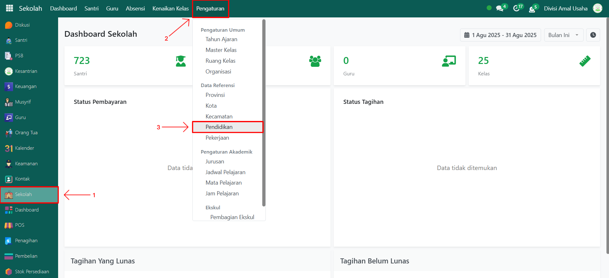
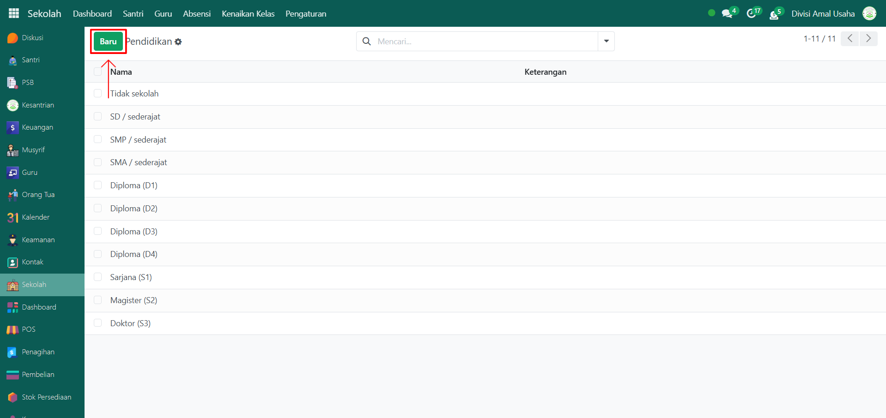
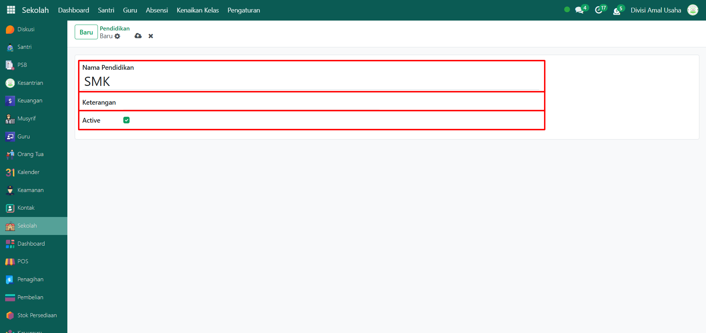
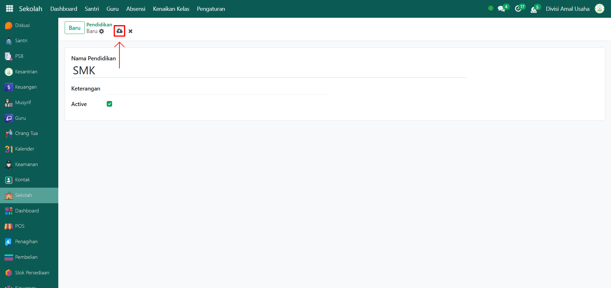

# Pendidikan

Video \[]

## Master Data - Pendidikan

**Data Pendidikan** adalah data referensi yang digunakan untuk mencatat tingkat pendidikan terakhir, baik untuk orang tua, wali, maupun pihak lain yang terkait di Odoo Pesantren. Data ini berguna untuk pendataan latar belakang pendidikan agar sistem memiliki informasi yang lebih lengkap.

### Melihat/Menambahkan Data Pendidikan

Berikut adalah langkah-langkah untuk melihat atau menambahkan data pendidikan pada Odoo Pesantren.

1.  Buka modul **Sekolah**, lalu klik menu **Pengaturan** dan pilih submenu **Pendidikan**.

    <figure><figcaption></figcaption></figure>

2.  Klik tombol **"Baru"** untuk membuat data Pendidikan baru.

    <figure><figcaption></figcaption></figure>

3.

    Akan tampil halaman form, isi inputan yang tersedia seperti:

    * **Nama Pendidikan** (misalnya: SD, SMP, SMA, S1, S2)
    * **Keterangan** (opsional, bisa diisi dengan informasi tambahan mengenai pendidikan tersebut)
    * **Active** (berupa checkbox, jika diaktifkan maka data Pendidikan dapat dipakai untuk pendataan orang tua, wali, atau kebutuhan lainnya)

    <figure><figcaption></figcaption></figure>

4.  Setelah semua inputan diisi dengan benar, klik ikon **Simpan** di sebelah kanan ikon **Gear** agar data Pendidikan tersimpan di sistem.

    <figure><figcaption></figcaption></figure>

5. Data Pendidikan yang berhasil disimpan dapat digunakan pada form lain, misalnya saat mengisi data orang tua atau wali santri.
