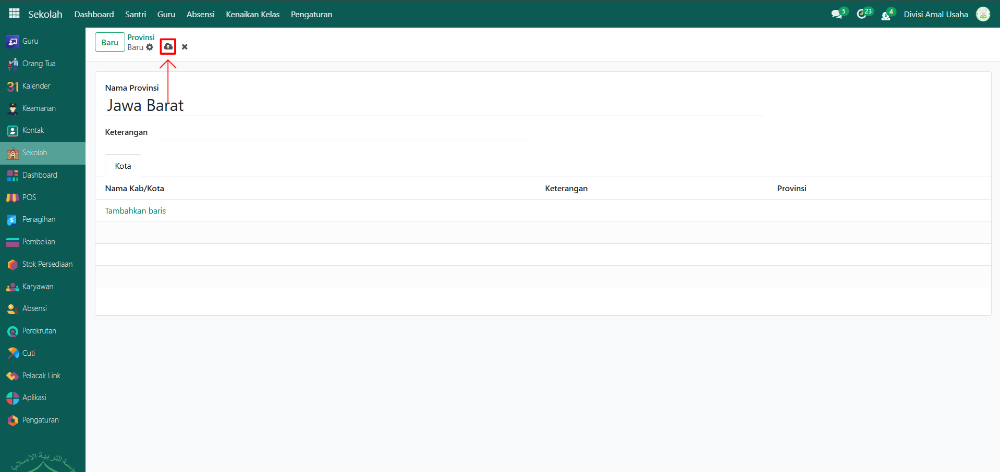

# Provinsi



## Master Data - Provinsi

Data **Provinsi** adalah data referensi wilayah administratif tingkat pertama yang digunakan untuk melengkapi informasi alamat santri, orang tua, maupun pihak lain di Odoo Pesantren. Data provinsi sudah lengkap tersedia di dalam sistem.

### Melihat dan Menambahkan Provinsi

Berikut adalah langkah-langkah untuk menambahkan provinsi pada Odoo Pesantren.

1. Login menggunakan akun administrator. Jika Anda belum memahami cara login sebagai admin, silakan lihat panduan [**Login Admin** di sini](../../panduan-login/login-admin.md).
2.  Buka modul **Sekolah**, lalu klik menu **Pengaturan** kemudian pilih submenu **Provinsi**.

    <figure><figcaption></figcaption></figure>

3.  Sistem akan menampilkan list lengkap provinsi yang ada di Indonesia.

    <figure><figcaption></figcaption></figure>

4.  Klik salah satu data provinsi (misalnya: _Jawa Timur_) untuk melihat detail informasinya.

    <figure><figcaption></figcaption></figure>

5.  Jika ada provinsi yang belum tersedia, Anda bisa klik tombol **Baru** untuk menambahkannya.

    <figure><figcaption></figcaption></figure>

6.  Akan tampil halaman form provinsi, isi inputan yang tersedia seperti:

    * **Nama Provinsi** (misalnya: Jawa Barat)
    * **Keterangan** (Opsional)
    * **Tab Kota** di bagian bawah tidak perlu diisi. Karena akan terisi otomatis apabila ada data kota yang termasuk kedalam provinsi tersebut.

    <figure><figcaption></figcaption></figure>

7.  Setelah semua inputan diisi dengan benar, klik icon **Simpan** di sebelah kanan icon **Gear** agar data provinsi baru tersimpan di sistem.

    <figure><figcaption></figcaption></figure>

### Edit dan Hapus Data Provinsi

Untuk mengedit suatu data provinsi, silahkan pilih terlebih dahulu data mana yang akan diedit. Editlah data provinsi dan klik icon **Simpan** untuk menyimpan data perubahan tersebut.

Untuk menghapus suatu data provinsi adalah dengan pilih data mana yang akan dihapus, kemudian klik icon **Gear** atau **Action** lalu pilih opsi **Hapus**, maka akan tampil dialog konfirmasi apakah anda ingin menghapus data tersebut. Jika ya, klik **Hapus** jika tidak maka klik **Tidak, tetap simpan**.

***


Data **Provinsi** bawaan sistem sebaiknya tidak dihapus. Penambahan diperbolehkan bila memang ada data yang belum tersedia.

