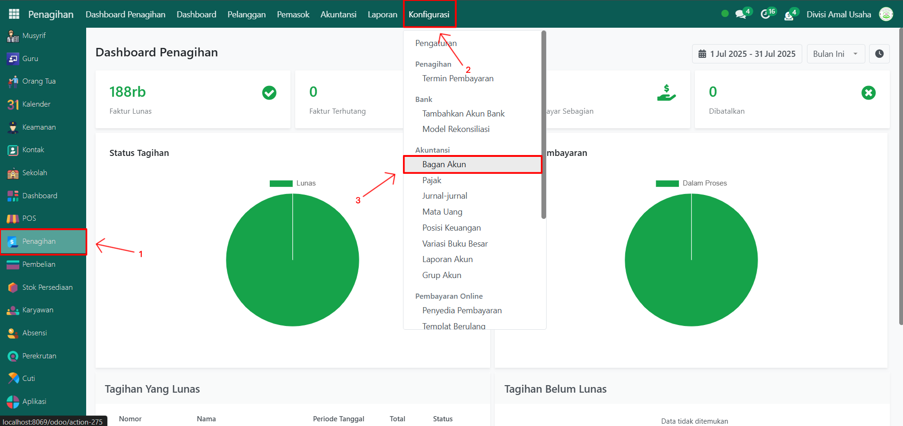
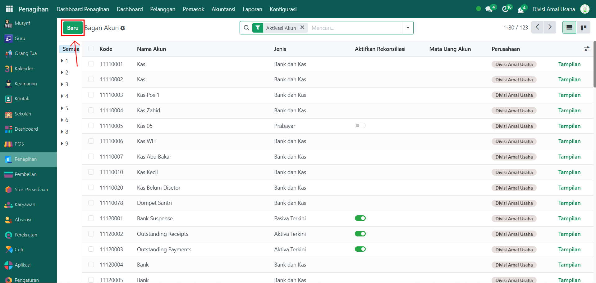
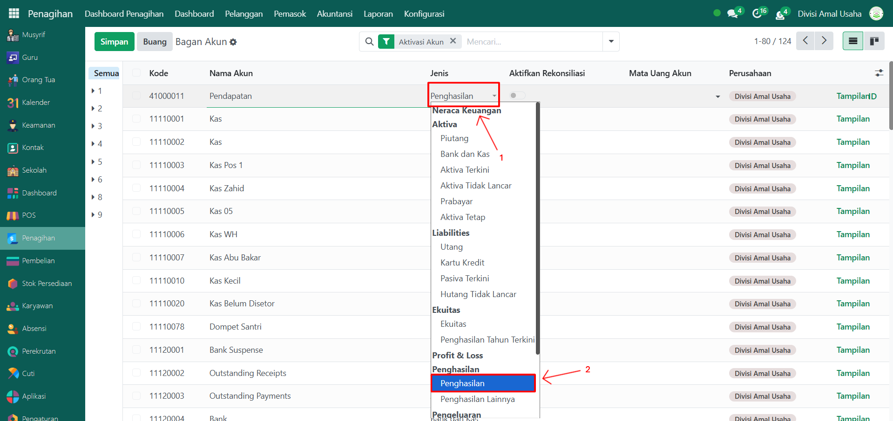
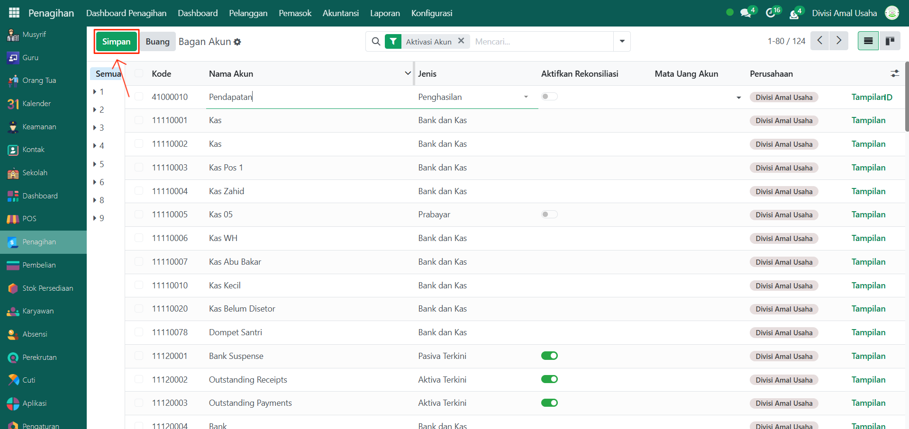

# Chart of Account

Video \[]

## Konfigurasi Chart of Account Odoo Pesantren

Chart of Account (COA) adalah daftar akun-akun yang digunakan untuk mencatat transaksi keuangan pesantren, seperti kas, bank, piutang, pendapatan, dan beban.

### Mengkonfigurasi Chart of Account

Berikut langkah-langkah cara mengkonfiurasi chart of account di Odoo Pesantren.

1.  Buka **Modul Penagihan**, lalu klik menu **Konfigurasi** kemudian pilih submenu **Bagan Akun/Chart of Account**.

    <figure><figcaption></figcaption></figure>

2.  Klik tombol **“Baru”** untuk menambahkan akun baru.

    <figure><figcaption></figcaption></figure>

3.  Isi inputan akun, seperti:

    * **Kode Akun** → nomor unik akun (misalnya 41000011 untuk Pendapatan).
    * **Nama Akun** → nama akun (misalnya Kas, Bank, Piutang Usaha, Pendapatan, Beban Operasional).
    * **Jenis Akun** → tentukan jenisnya (Aktiva, Liabilities, Ekuitas, Penghasilan, Pengeluaran).

    <figure><figcaption></figcaption></figure>

4.  Klik **Simpan** untuk menambahkan akun ke daftar COA.

    <figure><figcaption></figcaption></figure>

5. Ulangi langkah ini sampai semua akun dasar yang dibutuhkan pesantren tersedia.

***

## Contoh Chart of Account Dasar untuk Pesantren

| Nama Akun           | Tipe Akun                    | Keterangan                                                                                           |
| ------------------- | ---------------------------- | ---------------------------------------------------------------------------------------------------- |
| Kas (Cash)          | Bank dan Kas (Bank and Cash) | Menyimpan transaksi tunai harian pesantren.                                                          |
| Bank                | Bank dan Kas (Bank and Cash) | Mencatat transaksi keuangan melalui bank.                                                            |
| Dompet Santri       | Bank dan Kas (Bank and Cash) | Mencatat transaksi keuangan melalui dompet santri.                                                   |
| Piutang Usaha       | Piutang (Receivable)         | Mencatat piutang dari orang tua/santri terkait tagihan.                                              |
| Piutang Usaha (PoS) | Piutang (Receivable)         | Mencatat piutang dari orang tua/santri terkait tagihan yang digunakan di POS.                        |
| Modal               | Ekuitas (Equity)             | Modal awal/penyertaan pesantren.                                                                     |
| Penjualan           | Penghasilan (Income)         | Mencatat pendapatan dari berbagai transaksi seperti penjualan di POS, biaya pendidikan, dan lainnya. |
| Beban Gaji          | Pengeluaran (Expense)        | Beban gaji guru, musyrif, dan staf pesantren.                                                        |
| Beban Operasional   | Pengeluaran (Expense)        | Beban listrik, air, internet, kebersihan, dll.                                                       |
| Pajak PPN           | Liabilitas (Liabilities)     | Mencatat Pajak PPN Pembelian atau Penjualan.                                                         |
