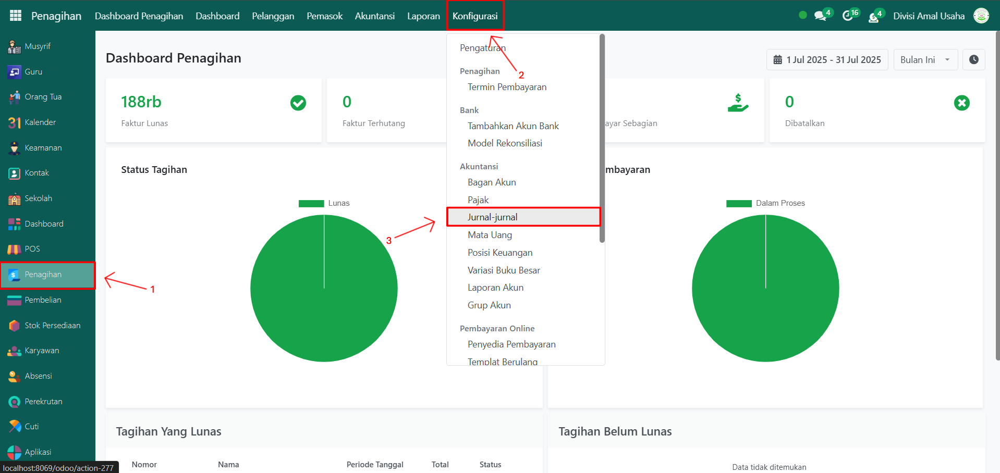
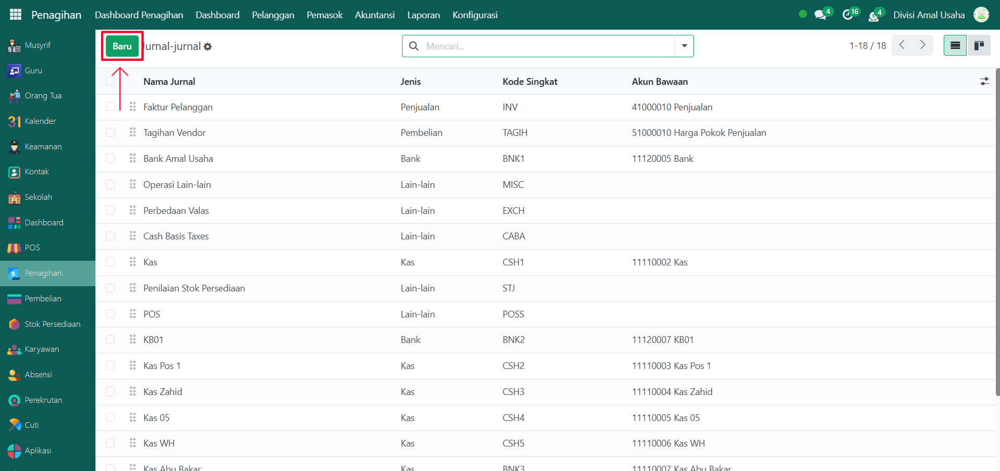
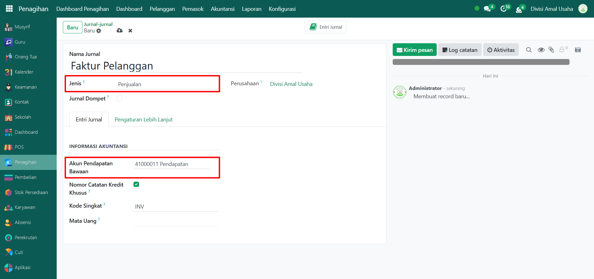
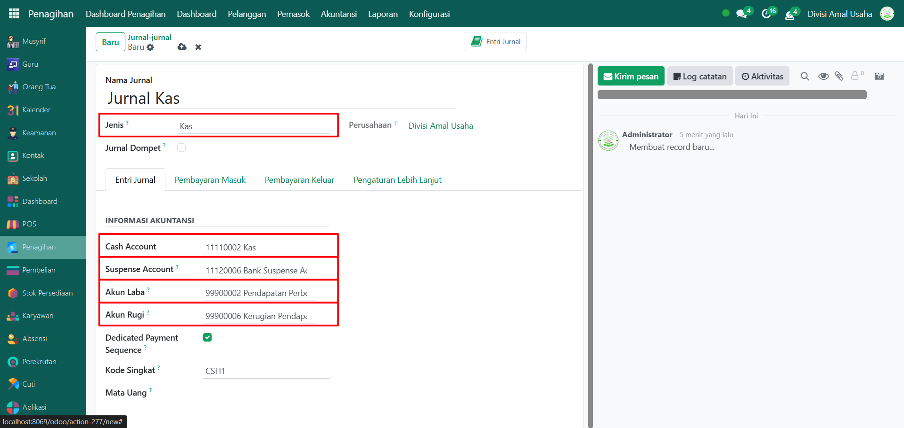
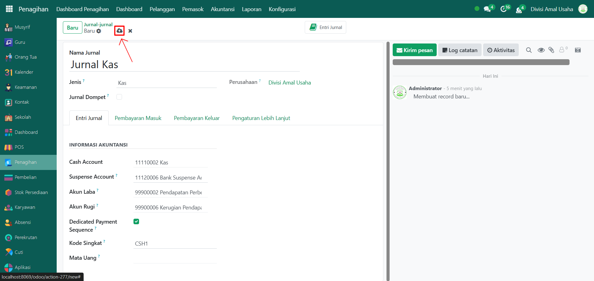
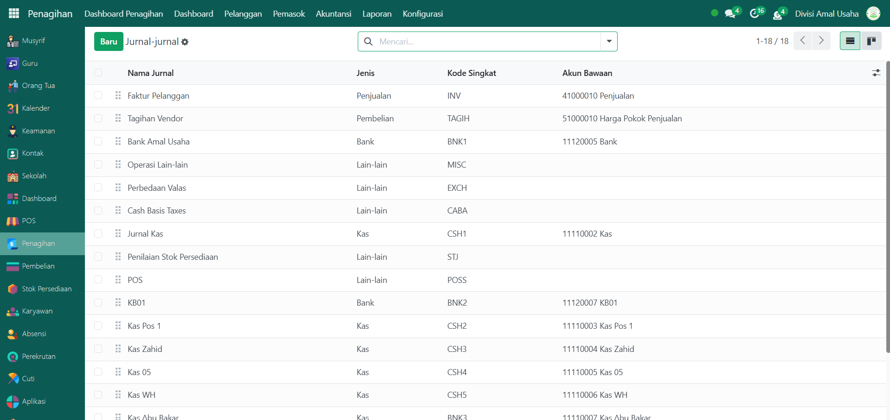
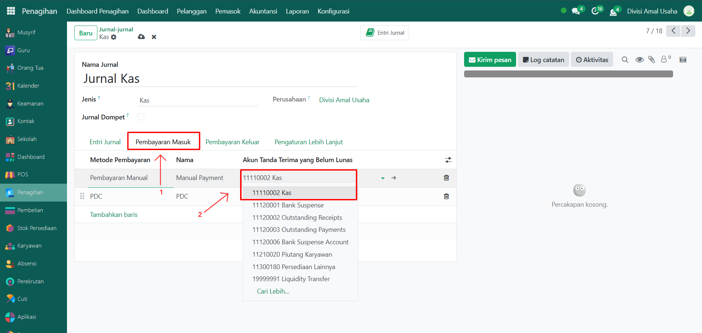
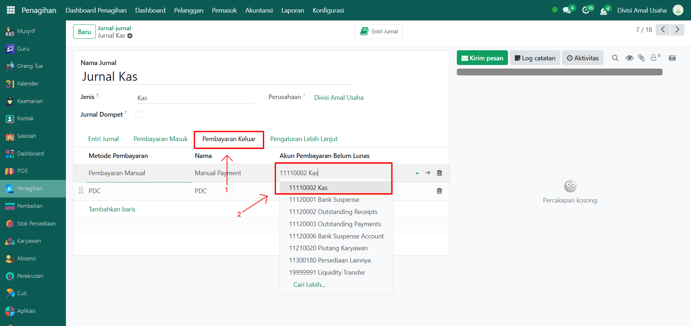
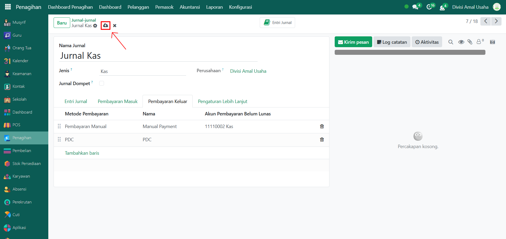

# Jurnal Akuntansi

Video \[]

## Konfigurasi Jurnal Akuntansi Odoo Pesantren

Jurnal adalah wadah pencatatan transaksi keuangan di Odoo yang berfungsi untuk mengelompokkan setiap transaksi berdasarkan jenisnya. Dengan jurnal, setiap transaksi dapat dicatat secara sistematis ke akun-akun pada **Chart of Account (COA)**.

Dalam Odoo Pesantren, jurnal digunakan untuk mencatat transaksi seperti penerimaan pembayaran dari orang tua, pembayaran tagihan ke pemasok, transaksi kas dan bank, hingga pengelolaan dompet santri.

### Mengkonfigurasi Jurnal Akuntansi

Berikut adalah langkah-langkah cara mengkonfiugrasi jurnal akuntansi agar dapat mencatat transaksi dengan baik.

1.  Buka **Modul Penagihan**, lalu klik menu **Konfigurasi** kemudian pilih submenu **Jurnal-jurnal.**

    <figure><figcaption></figcaption></figure>

2.  Klik tombol **“Baru”** untuk membuat jurnal baru.

    <figure><figcaption></figcaption></figure>

3.  Isi inputan form jurnal seperti:

    * **Nama Jurnal** → contoh: Jurnal Kas, Jurnal Bank, Jurnal Penjualan, Faktur Pelanggan.
    * **Jenis Jurnal** → pilih (Penjualan, Pembelian, Kas, Bank, Operasi lain-lain).
    * **Akun Pendapatan Bawaan** → Jika Jenis jurnal yaitu Pendapatan

    <figure><figcaption></figcaption></figure>

4.  Isi inputan lainnya seperti jurnal kas/bank, inputan form jurnal seperti:

    * **Nama Jurnal** → contoh: Jurnal Kas.
    * **Jenis Jurnal** → pilih (Penjualan, Pembelian, Kas, Bank, Operasi lain-lain).
    * **Cash Account** → pilih akun kas yang telah dibuat di chart of account.
    * **Suspense Account** → pilih default suspense account yang ada di chart of account.
    * **Akun Laba** → pilih akun laba yang ada di chart of account.
    * **Akun Rugi** → pilih akun rugi yang ada di chart of account.

    <figure><figcaption></figcaption></figure>

5.

    <figure><figcaption></figcaption></figure>
6. Terakhir, klik icon **Simpan** di sebelah kanan icon **Gear** agar jurnal akuntansi tersimpan di sistem.

***

### Konfigurasi Jurnal Kas/Bank untuk Pembayaran Masuk dan Keluar

Pada Odoo, setiap transaksi keuangan yang menggunakan **Kas** atau **Bank** dapat dikelola melalui jurnal khusus. Tab **Pembayaran Masuk (Incoming Payment)** dan **Pembayaran Keluar (Outgoing Payment)** diatur untuk memastikan bahwa uang yang masuk maupun keluar selalu menggunakan akun yang tepat.

Berikut langkah-langkah konfigurasi pembayaran masuk dan keluar pada jurnal kas/bank.

1.  Pada halaman **Jurnal-jurnal**, lalu pilih salah satu jurnal kas/bank yang ingin dikonfigurasi.

    <figure><figcaption></figcaption></figure>

2.  Ditampilan form jurnal kas/bank, klik Tab **"Pembayaran Masuk"** untuk mengkonfigurasi pembayaran masuk dengan menggunakan akun kas/bank yang tepat.

    <figure><figcaption></figcaption></figure>

3.  Selanjutnya, klik Tab **"Pembayaran Keluar"** untuk mengkonfigurasi pembayaran keluar dengan menggunakan akun kas/bank yang tepat.

    <figure><figcaption></figcaption></figure>

4.  Dan yang terakhir, klik icon **Simpan** di sebelah kanan icon **Gear** agar konfigurasi jurnal kas/bank tersimpan di sistem.

    <figure><figcaption></figcaption></figure>

***

> Note:
>
> 1. **Manual Payment** artinya setiap transaksi dicatat secara manual sesuai jumlah pembayaran, bukan otomatis via integrasi bank.
> 2. **Incoming Payment** dipakai untuk mencatat pembayaran yang diterima dari orang tua, santri, atau donatur.
> 3. **Outgoing Payment** dipakai untuk mencatat pembayaran keluar seperti pembelian barang, pembayaran gaji, atau biaya operasional.
> 4. Akun **Kas/Bank** dipakai agar arus keuangan tercatat ke akun yang sesuai dalam Chart of Account.

***

## Contoh Jurnal yang Diperlukan di Odoo Pesantren

| Nama Jurnal       | Jenis             | Fungsi / Keterangan                                                                     |
| ----------------- | ----------------- | --------------------------------------------------------------------------------------- |
| Faktur Pelanggan  | Penjualan         | Digunakan untuk mencatat penjualan atau tagihan kepada orang tua/santri.                |
| Tagihan Pemasok   | Pembelian         | Digunakan untuk mencatat pembelian barang/jasa dari pemasok/vendor.                     |
| Operasi Lain-lain | Operasi lain-lain | Untuk mencatat transaksi manual atau penyesuaian akuntansi.                             |
| Kas               | Kas               | Digunakan untuk mencatat transaksi tunai harian pesantren.                              |
| Bank Amal Usaha   | Bank              | Digunakan untuk mencatat transaksi melalui rekening bank pesantren.                     |
| Dompet Santri     | Bank              | Digunakan untuk mencatat transaksi dompet digital santri (uang saku, transfer, mutasi). |
