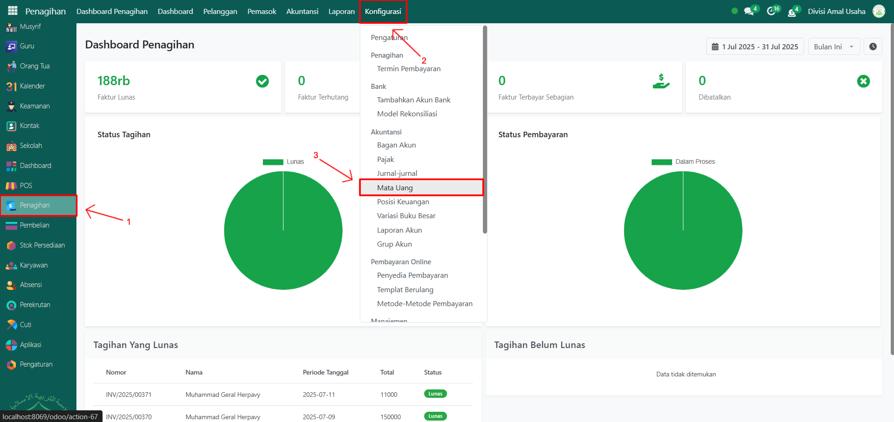
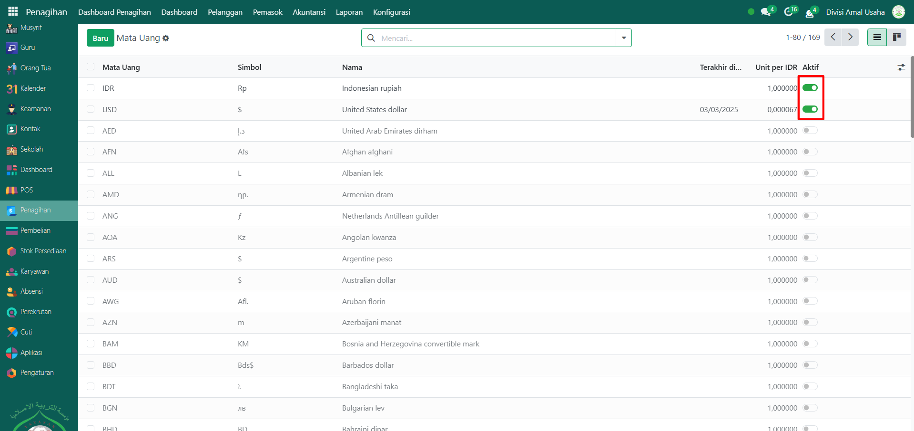
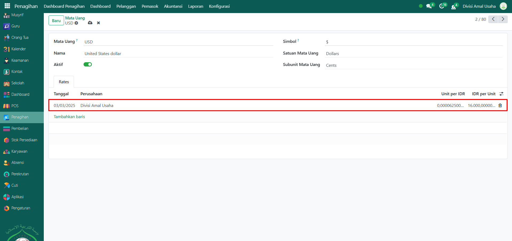
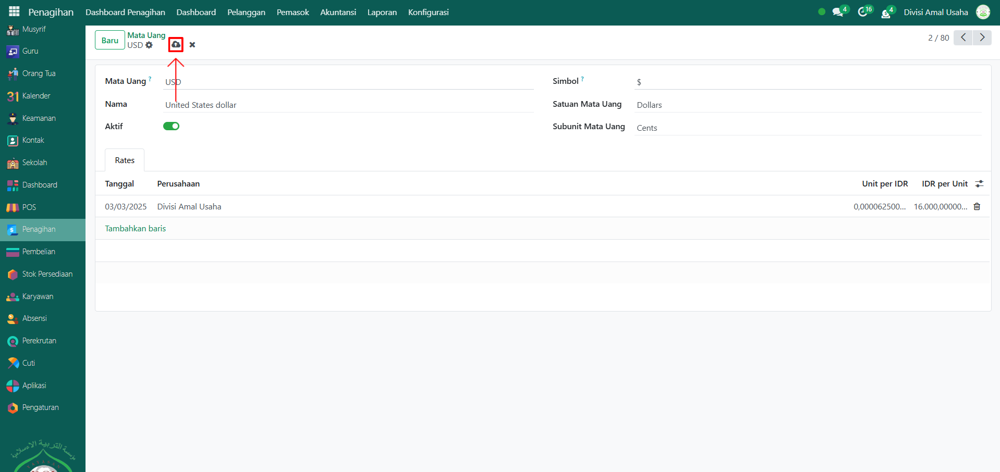

# Mata Uang



## Mata Uang

**Mata Uang** adalah konfigurasi di modul **Penagihan** yang digunakan untuk mengatur jenis mata uang yang dipakai dalam transaksi, baik untuk penjualan maupun pembelian. Sistem Odoo memungkinkan penggunaan lebih dari satu mata uang (multi currency), misalnya Rupiah (IDR) dan Dollar Amerika (USD), dengan kurs yang bisa diatur secara manual.

### Konfigurasi Mata Uang pada Perusahaan

Berikut adalah langkah-langkah untuk mengkonfigurasi mata uang di perusahaan pada Odoo Pesantren.

1.  Buka **Modul Penagihan**, lalu klik menu **Pengaturan** kemudian pilih submenu **Mata Uang**.

    <figure><figcaption></figcaption></figure>

2.  Pilih mata uang yang ingin diaktifkan, misalnya **IDR** (default) dan **USD**.

    <figure><figcaption></figcaption></figure>

3.  Jika ingin menggunakan kurs untuk USD, klik mata uang **USD**, lalu pada bagian **Tab Rates** tambahkan kurs baru dengan mengisi:

    * **Tanggal** → tanggal berlakunya kurs.
    * **Perusahaan** → nama perusahaan atau pesantren yang menggunakan kurs ini.
    * **Unit per IDR** → jumlah unit USD dalam Rupiah.
    * **IDR per Unit** → nilai tukar Rupiah per 1 USD.

    <figure><figcaption></figcaption></figure>

4.  Terakhir, klik icon **Simpan** di sebelah kanan icon **Gear** agar jurnal akuntansi tersimpan di sistem.

    <figure><figcaption></figcaption></figure>

5.  Data mata uang berhasil dikonfigurasi dan siap digunakan pada transaksi penagihan maupun pembayaran.

