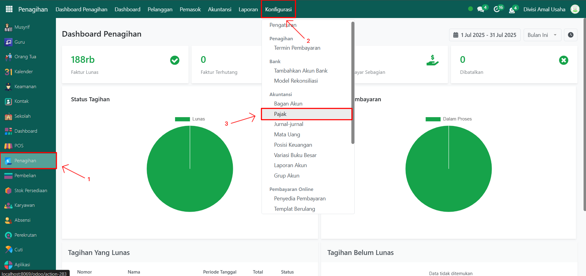
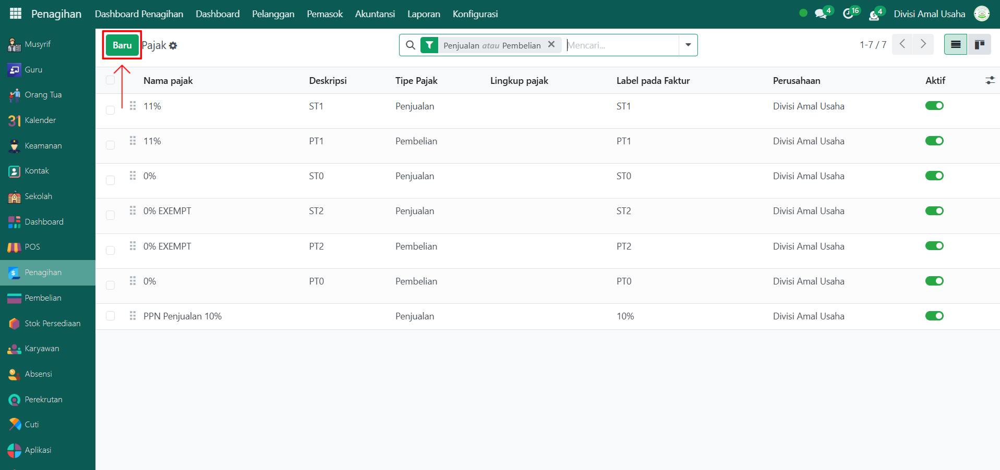
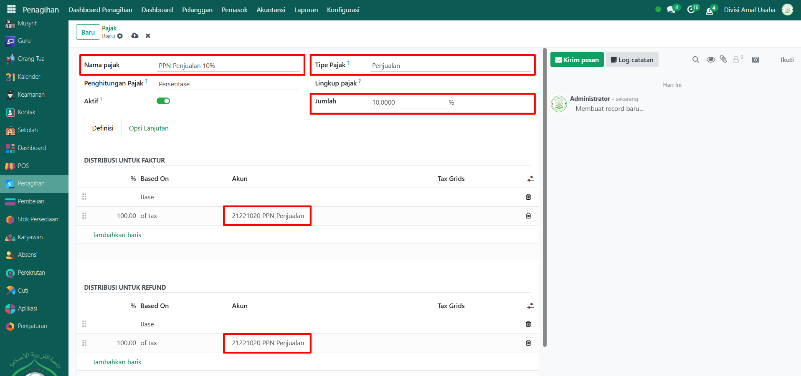
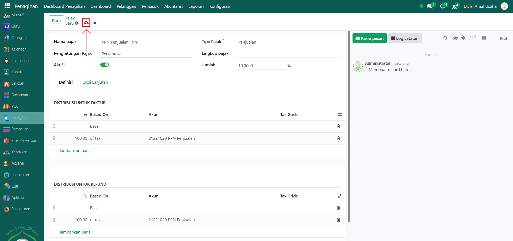
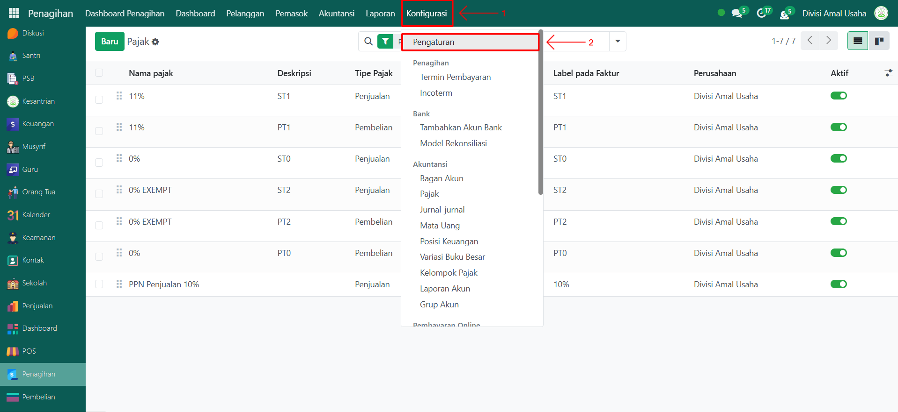
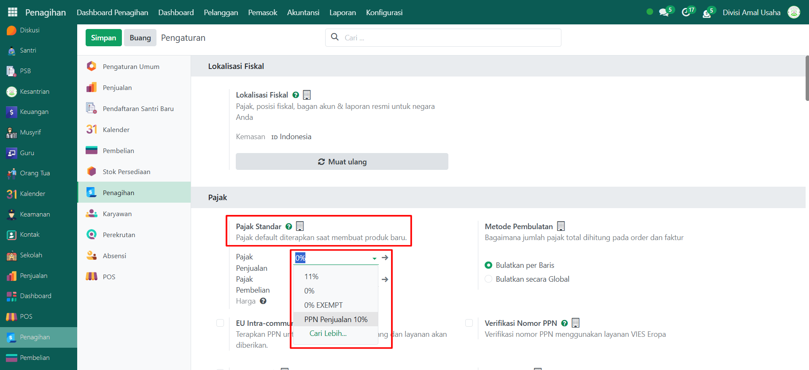
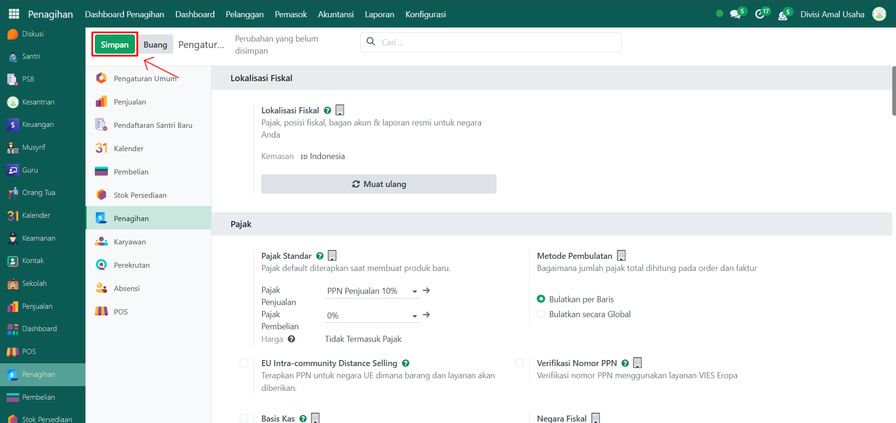

# Pajak



## Membuat Pajak Baru di Odoo Pesantren

**Pajak** adalah konfigurasi pada modul **Penagihan** yang digunakan untuk mendefinisikan tarif dan jenis pajak yang berlaku pada transaksi penjualan maupun pembelian di pesantren, misalnya PPN. Pajak ini nantinya akan otomatis ditarik ketika membuat faktur pelanggan atau tagihan pemasok.

### Menambahkan Pajak Baru

Berikut adalah langkah-langkah untuk membuat pajak baru misalnya pajak penjualan dan pajak pembelian.

1.  Buka **Modul Penagihan**, lalu klik menu **Pengaturan** kemudian pilih submenu **Pajak**.

    <figure><figcaption></figcaption></figure>

2.  Klik tombol **"Baru"** untuk membuat pajak baru.

    <figure><figcaption></figcaption></figure>

3.  Akan tampil halaman form, isi inputan yang tersedia seperti:

    * **Nama Pajak** → contoh: _PPN 10%_.
    * **Tipe Pajak** → pilih _Penjualan_, _Pembelian_, atau _Tidak Ada_.
    * **Jumlah** → masukkan angka tarif pajak, contoh: 10%.
    * **Distribusi untuk Faktur** → isi dengan akun pajak penjualan (contoh: _PPN Penjualan_).
    * **Distribusi untuk Refund** → isi dengan akun pajak penjualan (contoh: _PPN Penjualan_).

    <figure><figcaption></figcaption></figure>

4.  Setelah semua inputan terisi dengan benar, klik icon **Simpan** di sebelah kanan icon **Gear** agar pajak tersimpan di sistem.

    <figure><figcaption></figcaption></figure>

5. Data pajak berhasil dibuat dan siap digunakan dalam transaksi penjualan maupun pembelian.

### Konfigurasi Pajak Standar Perusahaan

Setelah menambahkan pajak baru, baik untuk transaksi pembelian maupun penjualan, Anda dapat mengaturnya sebagai pajak standar perusahaan (_default tax_). Dengan demikian, setiap kali membuat produk baru, kolom pajak akan otomatis terisi dengan pajak standar yang sudah dikonfigurasi, sehingga mempermudah proses pencatatan transaksi.&#x20;

Berikut adalah langkah-langkah untuk mengatur pajak standar perusahaan pada Odoo Pesantren:

1.  Dalam modul **Penagihan**, klik menu **Konfigurasi** kemudian pilih submenu **Pengaturan**.

    <figure><figcaption></figcaption></figure>

2.  Pada bagian **Pajak**, pilih jenis pajak yang akan dijadikan standar perusahaan, baik untuk **Pajak Penjualan** maupun **Pajak Pembelian**.

    <figure><figcaption></figcaption></figure>

3.  Setelah menentukan pajak yang sesuai, klik tombol **"Simpan"** untuk menyimpan perubahan.

    <figure><figcaption></figcaption></figure>

4. Pajak standar perusahaan akan otomatis terisi pada kolom pajak ketika Anda membuat produk baru atau transaksi terkait, sehingga tidak perlu memilih pajak secara manual setiap kali.
