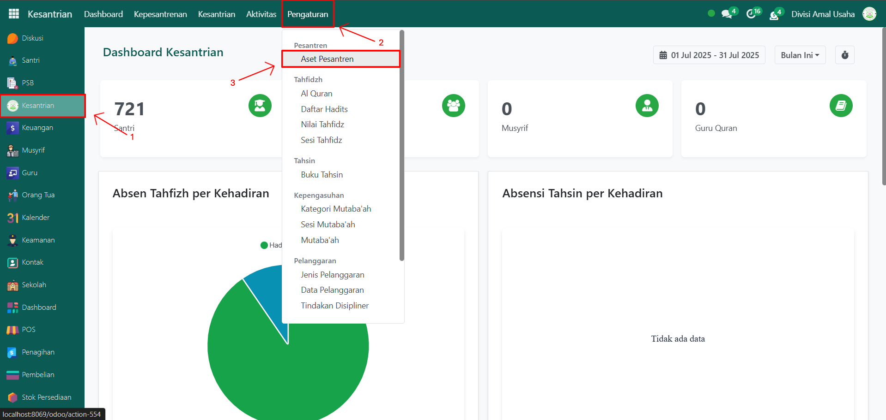
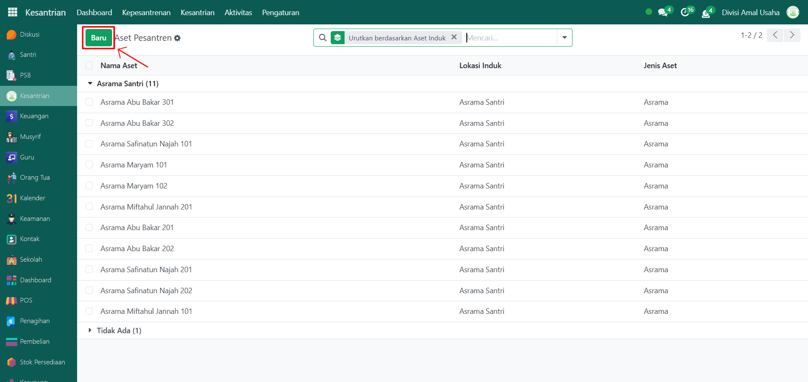
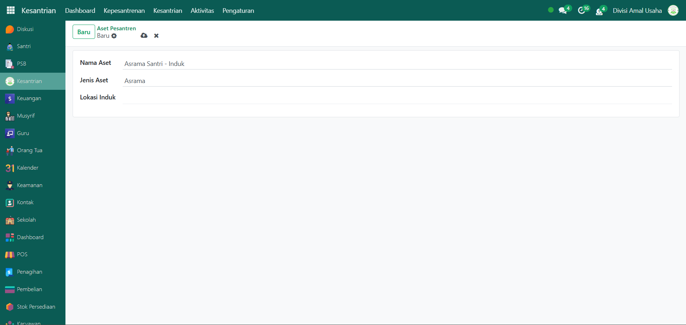
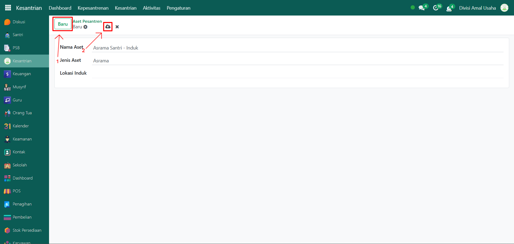
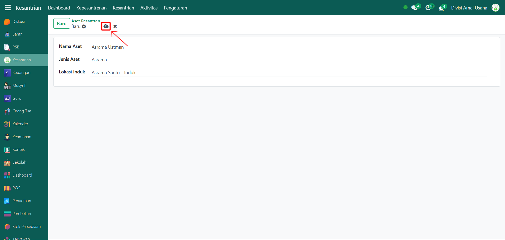

# Asrama & Kamar



## Asrama & Kamar Santri

**Asrama & Kamar Santri** pada Odoo Pesantren berfungsi untuk mengelola data tempat tinggal santri selama berada di lingkungan pesantren. Pengaturan ini memungkinkan administrator untuk mencatat pembagian asrama, penempatan kamar, serta siapa saja santri yang tinggal di masing-masing kamar.

## Membuat Asrama dan Kamar Santri

Berikut adalah langkah-langkah membuat asrama dan kamar santri.

1.  **Buka Modul Kesantrian**, lalu klik menu **Pengaturan** kemudian pilih submenu **Aset Pesantren**.

    <figure><figcaption></figcaption></figure>

2.  Klik tombol **“Baru”** untuk membuat **asrama induk**.

    <figure><figcaption></figcaption></figure>

3.  Pada halaman form, isi inputan yang tersedia seperti:

    * **Nama Aset** → contoh: _Asrama Santri - Induk_.
    * **Jenis Aset** → pilih _Asrama_.
    * **Lokasi Induk** → biarkan kosong karena ini adalah asrama utama.

    <figure><figcaption></figcaption></figure>

4.  Setelah data terisi, klik icon **Simpan** di sebelah kanan icon **Gear** agar asrama induk tersimpan di sistem, lalu untuk membuat **kamar-kamar di dalam asrama**, klik tombol **“Baru”** lagi.

    <figure><figcaption></figcaption></figure>

5. Pada form kamar, isi inputan yang tersedia seperti:
   * **Nama Aset** → contoh: _Asrama Utsman_.
   * **Jenis Aset** → pilih _Asrama_.
   * **Lokasi Induk** → pilih _Asrama Santri - Induk._
6.  Lalu klik icon **Simpan** di sebelah kanan icon **Gear** agar kamar santri tersimpan di sistem.

    <figure><figcaption></figcaption></figure>

7. Setelah selesai, data asrama dan kamar berhasil disimpan dan dapat digunakan dalam penempatan santri maupun kebutuhan operasional lainnya.

***

> Catatan:
>
> 1. Pastikan **asrama induk dibuat lebih dulu**, baru kemudian membuat kamar-kamar yang berada di bawah asrama tersebut.
> 2. Pengelompokan ini akan memudahkan dalam penempatan santri, pelaporan, dan pengelolaan data fasilitas.

