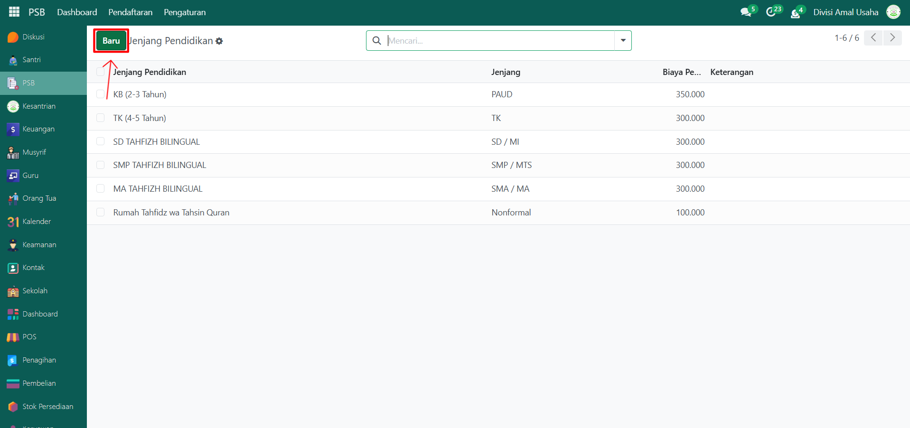
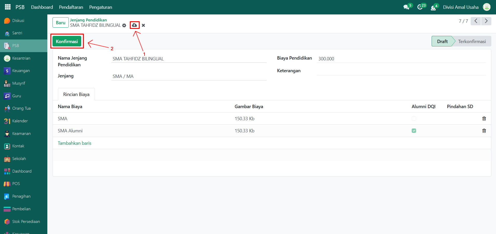

# Jenjang Pendidikan

Video \[]

## Membuat Jenjang Pendidikan Baru

Berikut adalah langkah-langkah cara membuat jenjang pendidikan baru.

1.  Buka **Modul PSB**, lalu klik menu **Pengaturan** dan pilih submenu **Jenjang Pendidikan**.

    <figure><figcaption></figcaption></figure>

2.  Klik tombol **“Baru”** untuk membuat jenjang pendidikan baru.

    <figure><figcaption></figcaption></figure>

3.  Pada halaman form, lakukan pengisian inputan yang tersedia:

    * **Nama Jenjang Pendidikan** → contoh: Sekolah Menengah Atas (SMA).
    * **Jenjang** → kategori singkat, misalnya SD/MI, SMP/MTs, SMA/MA.
    * **Biaya Pendidikan** → total biaya yang berlaku untuk jenjang tersebut.
    * **Keterangan (Opsional)** → catatan tambahan jika diperlukan.
    * **Tab Rincian Biaya** → untuk menambahkan biaya rincian per jenjang pendidikan.

    <figure><figcaption></figcaption></figure>

4.  Setelah seluruh field diisi dengan benar, klik **ikon Simpan** di sebelah icon **Gear** untuk menyimpan jenjang pendidikan, lalu klik tombol **Konfirmasi** untuk mengunci data jenjang pendidikan sehingga tidak bisa diubah sembarangan dan siap digunakan pada proses PSB maupun transaksi biaya pendidikan.

    <figure><figcaption></figcaption></figure>

5. Data jenjang pendidikan akan terkonfirmasi dan dapat digunakan pada proses PSB maupun transaksi biaya pendidikan.
