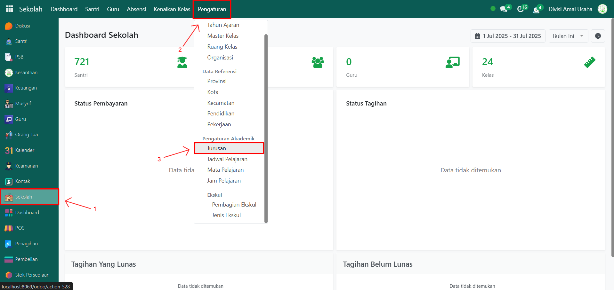
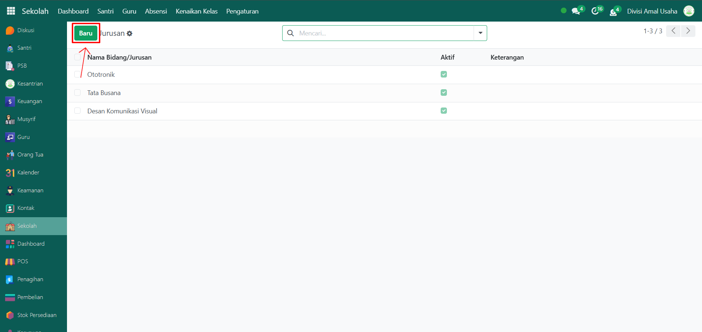
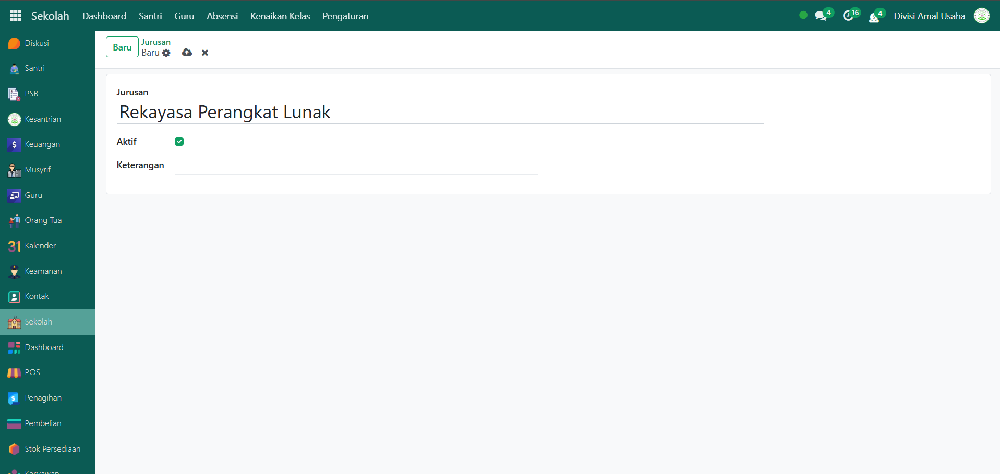
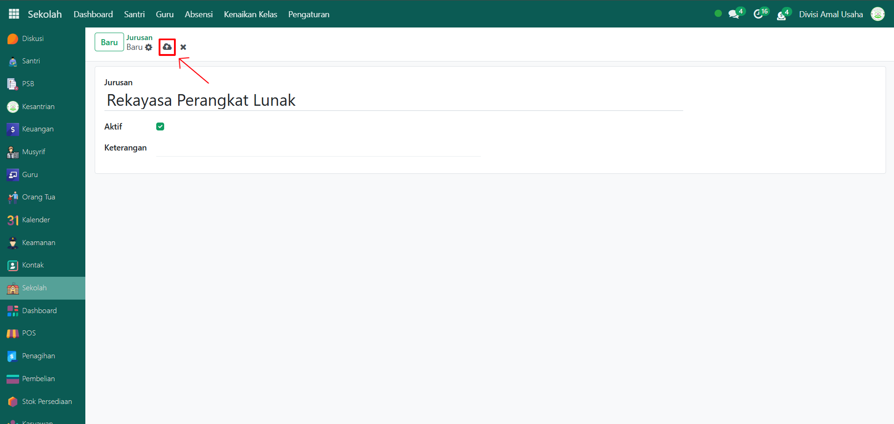
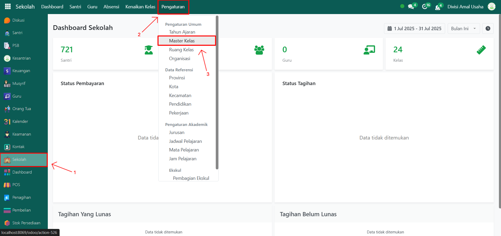
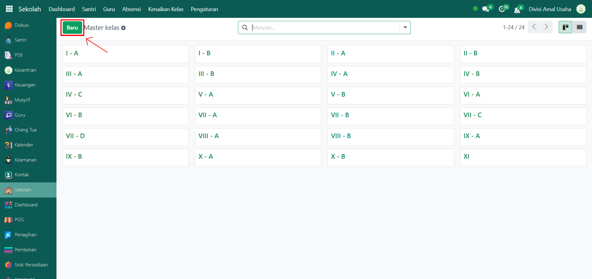
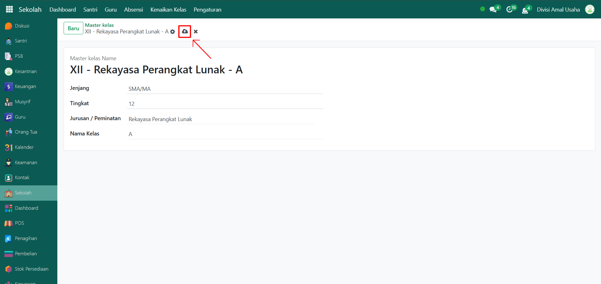

# Jurusan & Kelas



## Jurusan & Kelas

**Jurusan & Kelas** pada Odoo Pesantren digunakan untuk menentukan jurusan pendidikan serta kelas tempat siswa terdaftar. Pengaturan ini biasanya dilakukan saat menginput data siswa baru atau saat mengatur struktur akademik.

## Membuat Jurusan Baru

Berikut adalah langkah-langkah cara menambahkan jurusan baru pada Odoo Pesantren.

1.  **Buka Modul Sekolah**, lalu klik menu **Pengaturan** kemudian pilih submenu **Jurusan**.

    <figure><figcaption></figcaption></figure>

2.  Klik tombol **“Baru”** untuk menambahkan jurusan baru.

    <figure><figcaption></figcaption></figure>

3.  Pada halaman form, lakukan pengisian inputan yang tersedia:

    * **Nama Jurusan** → contoh: Rekayasa Perangkat Lunak.
    * **Aktif** → mengaktifkan jurusan pada sekolah.
    * **Keterangan (Opsional)** → catatan tambahan jika diperlukan.

    <figure><figcaption></figcaption></figure>

4.  Terakhir, klik icon **Simpan** di sebelah kanan icon **Gear** agar jurusan baru tersimpan di sistem.

    <figure><figcaption></figcaption></figure>

## Membuat Kelas Baru

Berikut adalah langkah-langkah membuat kelas baru untuk pendataan akademik santri di Modul Sekolah.

1.  **Buka Modul Sekolah**, lalu klik menu **Pengaturan** dan pilih submenu **Master Kelas**.

    <figure><figcaption></figcaption></figure>

2.  Klik tombol **“Baru”** untuk menambahkan master kelas baru.

    <figure><figcaption></figcaption></figure>

3.  Pada halaman form, lakukan pengisian inputan yang tersedia:

    * **Jenjang** → pilih jenjang pendidikan (SD/MI, SMP/MTs, SMA/MA, dst).
    * **Tingkat** → masukkan tingkat kelas, misalnya 10, 11, atau 12.
    * **Jurusan / Peminatan** → isi jurusan atau peminatan yang berlaku (contoh: Rekayasa Perangkat Lunak).
    * **Nama Kelas** → tentukan nama kelas, contoh: A.

    <figure><figcaption></figcaption></figure>

4.  Terakhir, klik icon **Simpan** di sebelah kanan icon **Gear** agar master kelas baru tersimpan di sistem.

    <figure><figcaption></figcaption></figure>

5. Kelas yang sudah dibuat akan muncul dalam daftar kelas dan siap digunakan untuk penempatan santri maupun proses pembelajaran.
