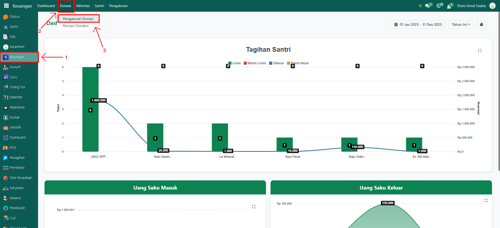
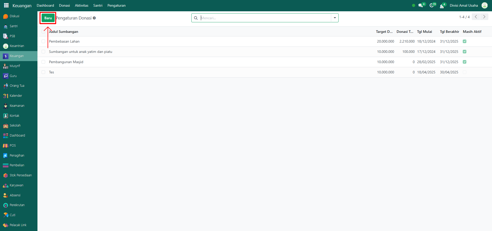
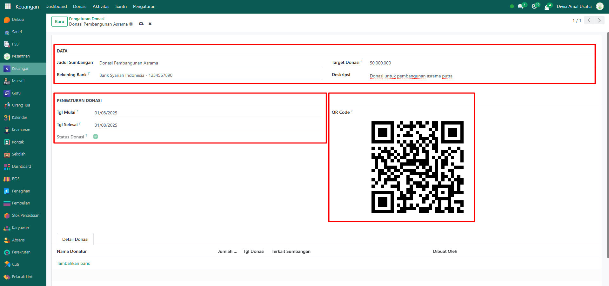
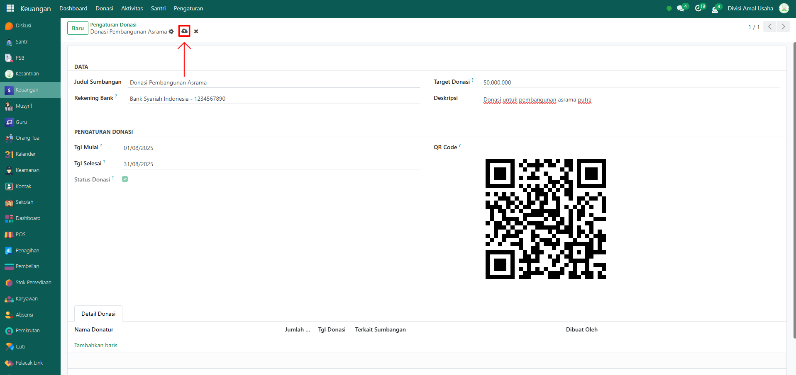

# Pengaturan Donasi

Video \[]

## Konfigurasi Pengaturan Donasi

**Pengaturan Donasi** digunakan untuk menambahkan dan mengelola jenis donasi yang ada di Odoo Pesantren, seperti donasi pembangunan, beasiswa, atau kegiatan sosial lainnya. Administrator dapat menentukan detail donasi mulai dari rekening bank, target donasi, hingga periode kegiatan.

### Mengkonfigurasi Pengaturan Donasi

Berikut adalah langkah-langkah untuk mengkonfigurasi pengaturan donasi pada Odoo Pesantren.

1.  Buka modul **Keuangan**, lalu klik menu **Donasi** kemudian pilih submenu **Pengaturan Donasi**.

    <figure><figcaption></figcaption></figure>

2.  Klik tombol **"Baru"** untuk membuat jenis donasi baru.

    <figure><figcaption></figcaption></figure>

3.  Akan tampil halaman form, isi inputan yang tersedia seperti:

    * **Judul Sumbangan** (misalnya: Donasi Pembangunan Asrama).
    * **Rekening Bank** (misalnya: Bank Syariah Indonesia - 1234567890).
    * **Target Donasi** (misalnya: Rp 50.000.000).
    * **Deskripsi** (opsional, misalnya: Donasi untuk pembangunan asrama putra).
    * **Tanggal Mulai** (misalnya: 01-08-2025).
    * **Tanggal Selesai** (misalnya: 31-08-2025).
    * **QR Code** (akan digunakan untuk mempermudah pembayaran donasi via scan).
    * **Tab Detail Donasi** akan otomatis terisi setelah ada transaksi donasi yang masuk.

    <figure><figcaption></figcaption></figure>

4.  Setelah semua inputan diisi dengan benar, klik ikon **Simpan** di sebelah kanan ikon **Gear** agar data donasi tersimpan di sistem.

    <figure><figcaption></figcaption></figure>

5. Data donasi berhasil dibuat dan dapat digunakan dalam proses transaksi donasi.
