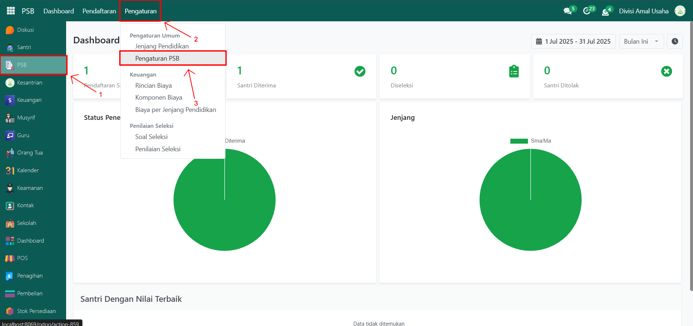
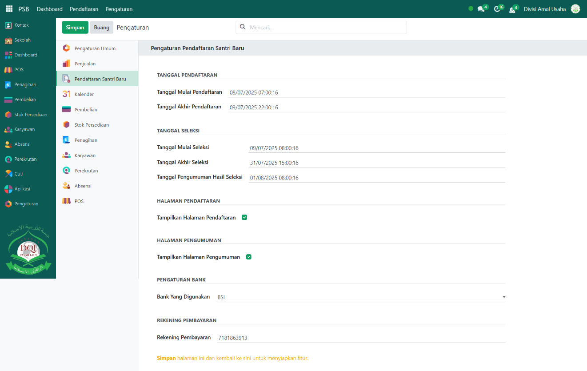
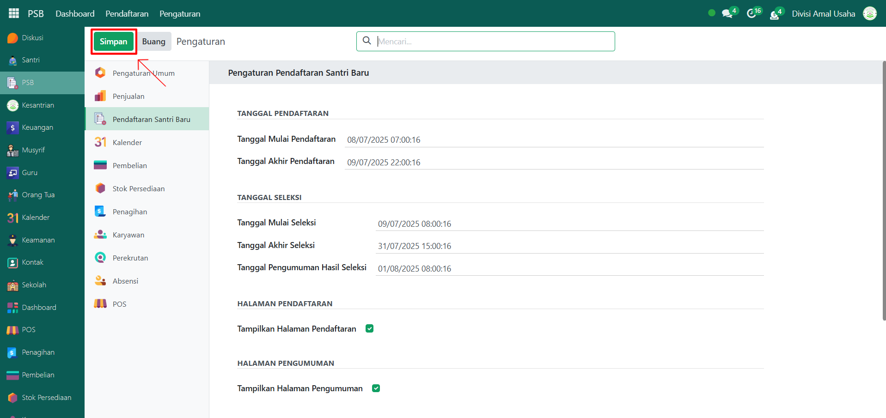

# Pengaturan PSB



## Pengaturan PSB

**Pengaturan PSB (Penerimaan Santri Baru)** pada Odoo Pesantren digunakan untuk menentukan jadwal dan parameter utama proses penerimaan siswa baru. Melalui menu ini, administrator dapat mengatur tanggal mulai dan berakhirnya pendaftaran, jadwal seleksi, pengumuman hasil, serta pengaturan lainnya yang berkaitan dengan proses PSB.

### Mengkonfigurasi Pengaturan PSB

Berikut adalah langkah-langkah cara mengkonfigurasi beberapa pengaturan pendaftaran santri baru pada Odoo Pesantren.

1.  **Buka Modul PSB**, lalu klik menu **Pengaturan** kemudian pilih submenu **Pengaturan PSB**.

    <figure><figcaption></figcaption></figure>

2.  Pada halaman konfigurasi, lakukan pengisian atau perubahan inputan berikut sesuai kebutuhan:

    * **Tanggal Mulai Pendaftaran** → tentukan kapan pendaftaran dimulai.
    * **Tanggal Akhir Pendaftaran** → tentukan kapan pendaftaran berakhir.
    * **Tanggal Mulai Seleksi** → tentukan kapan seleksi pendaftaran dimulai.
    * **Tanggal Akhir Seleksi** → tentukan kapan seleksi pendaftaran berakhir.
    * **Tanggal Pengumuman Hasil Seleksi** → isi jadwal resmi pengumuman hasil seleksi santri.
    * **Tampilkan Halaman Pendaftaran** → aktifkan agar halaman pendaftaran online dapat diakses calon santri.
    * **Tampilkan Halaman Pengumuman** → aktifkan agar halaman pengumuman hasil seleksi ditampilkan secara publik.
    * **Bank yang Digunakan** → pilih salah satu bank resmi (BSI, BRI, BNI, BCA, Mandiri, atau CIMB Niaga).
    * **Rekening Pembayaran** → isi nomor rekening pembayaran resmi yang digunakan pesantren.

    <figure><figcaption></figcaption></figure>

3.  Setelah semua inputan disesuaikan, klik tombol **Simpan** untuk menyimpan perubahan pada konfigurasi yang telah diatur.

    <figure><figcaption></figcaption></figure>
