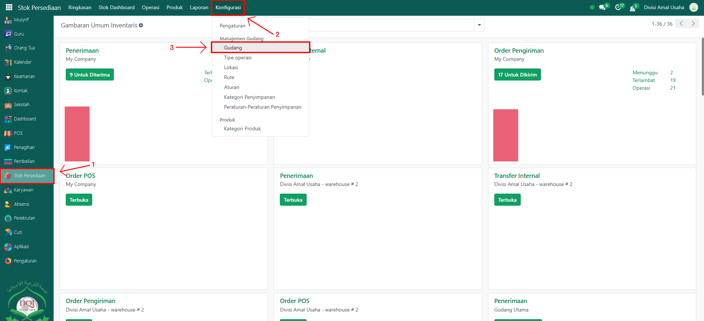
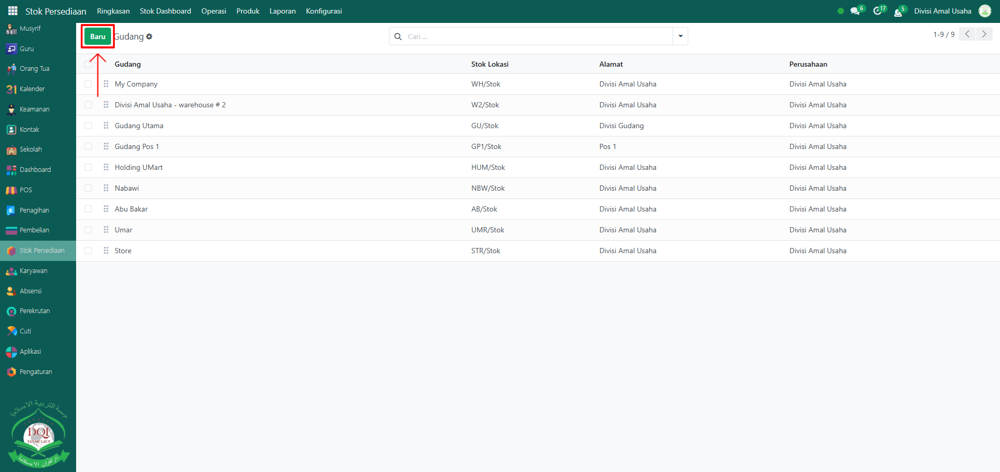
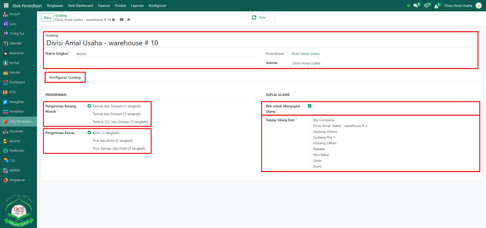
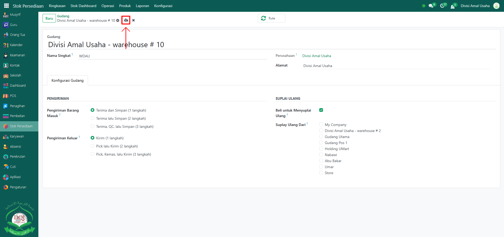

# Gudang

Video \[]

## Gudang

**Gudang** pada Odoo Pesantren digunakan untuk mengatur lokasi penyimpanan dan alur distribusi barang. Dengan konfigurasi gudang yang tepat, sistem dapat mengelola penerimaan, penyimpanan, dan pengiriman barang sesuai kebutuhan operasional pesantren.

### Mengkonfigurasi Gudang

Berikut adalah langkah-langkah untuk mengkonfigurasi gudang pada Odoo Pesantren.

1.  Buka modul **Stok Persediaan**, lalu klik menu **Konfigurasi** kemudian pilih submenu **Gudang**.

    <figure><figcaption></figcaption></figure>

2.  Klik tombol **"Baru"** untuk membuat gudang baru yang akan digunakan pada berbagai operasi (penerimaan, penyimpanan, pengiriman, maupun transfer internal).

    <figure><figcaption></figcaption></figure>

3.  Akan tampil halaman form **Gudang**, isi inputan yang tersedia seperti:

    * **Nama Gudang**
    * **Nama Singkat Gudang**
    * **Tab Konfigurasi Gudang**:
      * **Pengiriman Barang Masuk**
        * _Terima dan Simpan (1 langkah)_ → barang langsung masuk ke stok.
        * _Terima lalu Simpan (2 langkah)_ → barang diterima lalu dipindahkan ke lokasi penyimpanan.
        * _Terima, QC, lalu Simpan (3 langkah)_ → barang melalui proses pemeriksaan kualitas sebelum disimpan.
      * **Pengiriman Barang Keluar**
        * _Kirim (1 langkah)_ → barang langsung dikirim ke pelanggan.
        * _Pick lalu Kirim (2 langkah)_ → barang diambil terlebih dahulu lalu dikirim.
        * _Pick, Kemas, lalu Kirim (3 langkah)_ → barang diambil, dikemas, lalu dikirim.
      * **Beli untuk Menyuplai** (aktifkan jika gudang digunakan untuk menerima barang dari pembelian pemasok).
      * **Suplai Ulang Dari** (aktifkan gudang lain yang menjadi sumber suplai ulang stok jika diperlukan).

    <figure><figcaption></figcaption></figure>

4.  Setelah semua inputan diisi dengan benar, klik ikon **Simpan** di sebelah kanan ikon **Gear** agar data gudang tersimpan di sistem.

    <figure><figcaption></figcaption></figure>

5. Gudang yang sudah tersimpan akan otomatis muncul dalam pilihan operasi stok (penerimaan, pengiriman, dan transfer internal).
