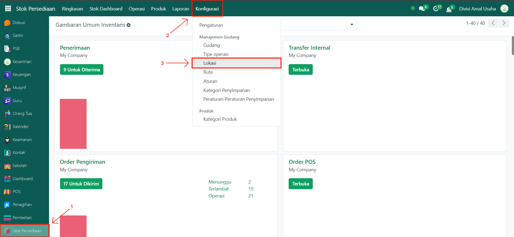
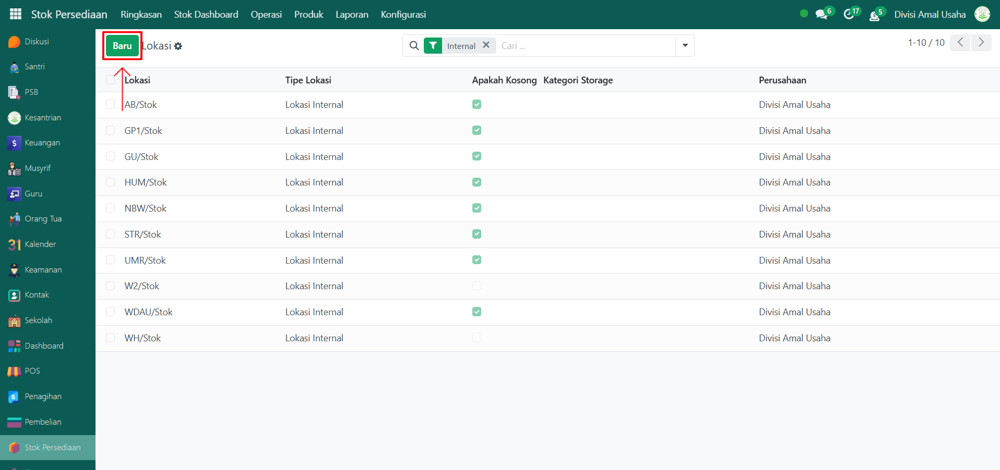
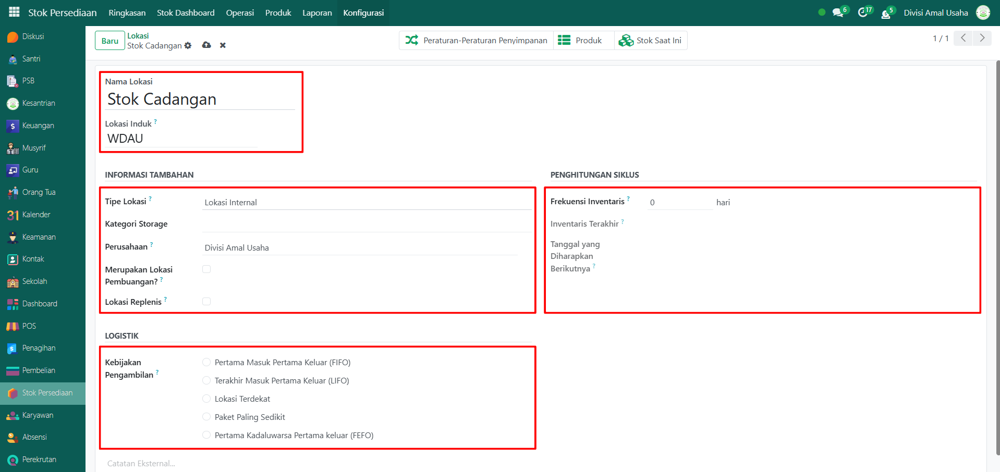
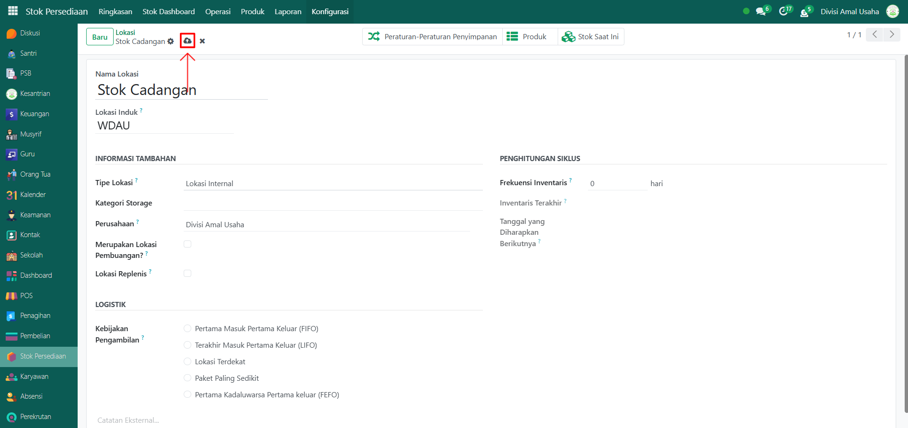

# Lokasi Dalam Gudang

Video \[]

## Lokasi Dalam Gudang

**Lokasi Dalam Gudang** pada Odoo Pesantren digunakan untuk mendetailkan area penyimpanan barang di dalam gudang. Misalnya, gudang utama dapat memiliki beberapa lokasi internal seperti rak, area pendingin, area karantina, atau tempat pembuangan. Dengan konfigurasi lokasi yang tepat, pengelolaan stok menjadi lebih terstruktur.

### Konfigurasi Lokasi Dalam Gudang

Berikut adalah langkah-langkah untuk mengkonfigurasi lokasi dalam gudang pada Odoo Pesantren.

1.  Buka modul **Stok Persediaan**, lalu klik menu **Konfigurasi** kemudian pilih submenu **Lokasi**.

    <figure><figcaption></figcaption></figure>

2.  Klik tombol **Baru** untuk membuat lokasi baru di dalam gudang.

    <figure><figcaption></figcaption></figure>

3.  Akan tampil halaman form **Lokasi**, isi inputan yang tersedia seperti:

    * **Nama Lokasi**
    * **Lokasi Induk** → pilih gudang yang sudah dibuat sebelumny.
    * **Tipe Lokasi** → tentukan jenis lokasi, seperti:
      * _Lokasi Internal_ (lokasi penyimpanan dalam gudang).
      * _Lokasi Pemasok_ (barang masuk dari vendor).
      * _Lokasi Pelanggan_ (barang keluar ke konsumen).
      * _Produksi_ (lokasi bahan/hasil produksi).
      * _Persediaan_ (stok awal atau penyesuaian).
    * **Merupakan Lokasi Pembuangan** → centang jika lokasi ini digunakan untuk barang rusak/afkir.
    * **Lokasi Replenis** → centang jika lokasi ini digunakan sebagai tempat pengisian ulang stok barang.
    * **Frekuensi Inventaris** → tentukan periode pengecekan inventaris di lokasi ini (misalnya: 1 bulan sekali).
    * **Kebijakan Pengambilan** → pilih metode pengambilan stok (radio button):
      * _FIFO_ (First In First Out, stok masuk lebih dulu diambil lebih dulu).
      * _LIFO_ (Last In First Out, stok terbaru diambil lebih dulu).
      * _Lokasi Terdekat_ (stok diambil dari lokasi yang paling dekat).
      * _Paket Paling Sedikit_ (stok diambil dari paket dengan kuantitas paling sedikit).
      * _FEFO_ (First Expired First Out, stok yang lebih dulu kadaluarsa akan diambil lebih dulu).

    <figure><figcaption></figcaption></figure>

4.  Setelah semua inputan diisi dengan benar, klik ikon **Simpan** di sebelah kanan ikon **Gear** agar data lokasi dalam gudang tersimpan di sistem.

    <figure><figcaption></figcaption></figure>

5. Lokasi yang sudah tersimpan dapat digunakan pada transaksi operasional seperti penerimaan barang, pengiriman barang, transfer internal, dan penyesuaian stok.
