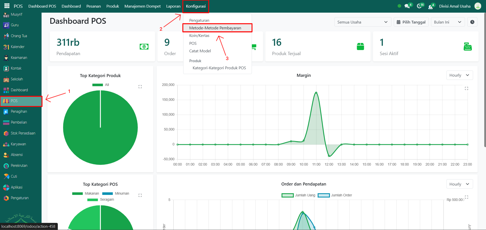
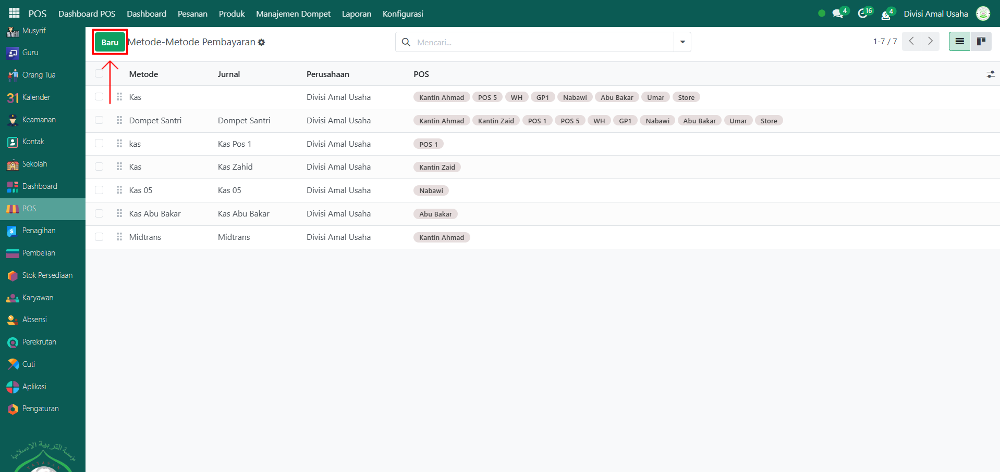

# Metode Pembayaran POS

Video \[]

## Metode Pembayaran POS

**Metode Pembayaran POS** adalah konfigurasi di modul **Point of Sale** yang digunakan untuk menentukan cara pembayaran transaksi penjualan, misalnya **Tunai, Transfer Bank, Dompet Santri, atau E-Wallet**. Dengan pengaturan ini, sistem dapat mencatat transaksi sesuai jurnal dan akun yang terhubung.

### Mengkonfigurasi Metode Pembayaran POS

Berikut adalah langkah-langkah untuk mengkonfigurasi metode pembayaran POS pada Odoo Pesantren.

1.  Buka **Modul POS**, lalu klik menu **Pengaturan** kemudian pilih submenu **Metode-Metode Pembayaran**.

    <figure><figcaption></figcaption></figure>

2.  Klik tombol **"Baru"** untuk membuat metode pembayaran baru.

    <figure><figcaption></figcaption></figure>

3.  Akan tampil halaman form, isi inputan yang tersedia seperti:

    * **Nama Metode** → misalnya _Dompet Santri_.
    * **Identifikasi Pelanggan** → aktifkan bila ingin metode ini terhubung dengan identitas santri.
    * **Jurnal** → pilih jurnal pembayaran untuk mencatat transaksinya, misalnya _Dompet Santri_.
    * **Akun Piutang** → misalnya _Piutang Usaha_.
    * **Akun Perantara** → misalnya _Piutang Usaha POS_.

    <figure><figcaption></figcaption></figure>
4.  Klik ikon **Simpan** di sebelah kanan ikon **Gear** agar metode pembayaran tersimpan di sistem.

    <figure><figcaption></figcaption></figure>
5.  Selanjutnya, buka kembali menu **Pengaturan** dan pilih submenu **POS** untuk konfigurasi lanjut.

    <figure><figcaption></figcaption></figure>

6.  Pilih **Sesi POS** yang sudah ada.

    <figure><figcaption></figcaption></figure>

7.  Tambahkan metode pembayaran (contoh: _Dompet Santri_) pada field **Metode-Metode Pembayaran**.

    <figure><figcaption></figcaption></figure>

8.  Klik tombol **Simpan** di bagian atas.

    <figure><figcaption></figcaption></figure>

9. Metode pembayaran berhasil diaktifkan dan siap digunakan pada transaksi di kasir POS.
