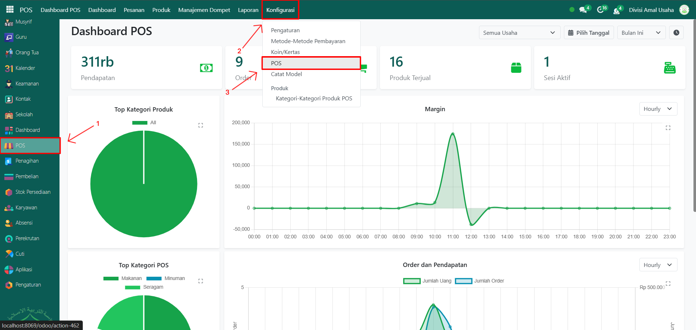
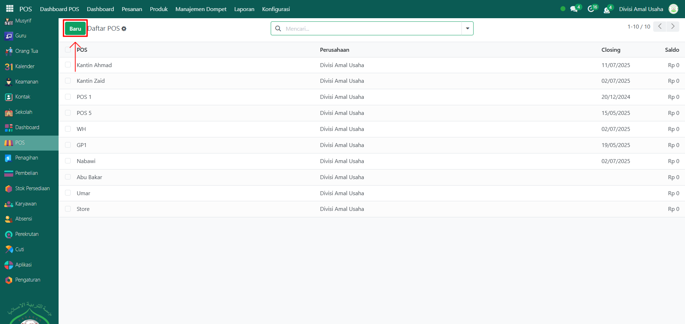
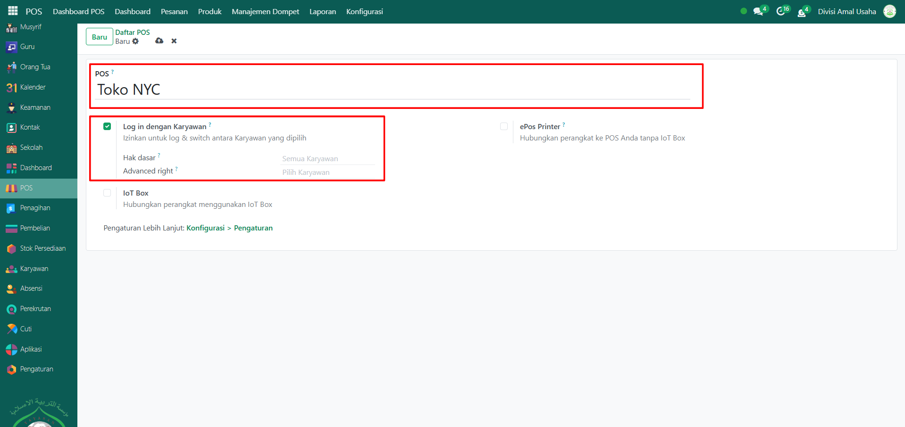
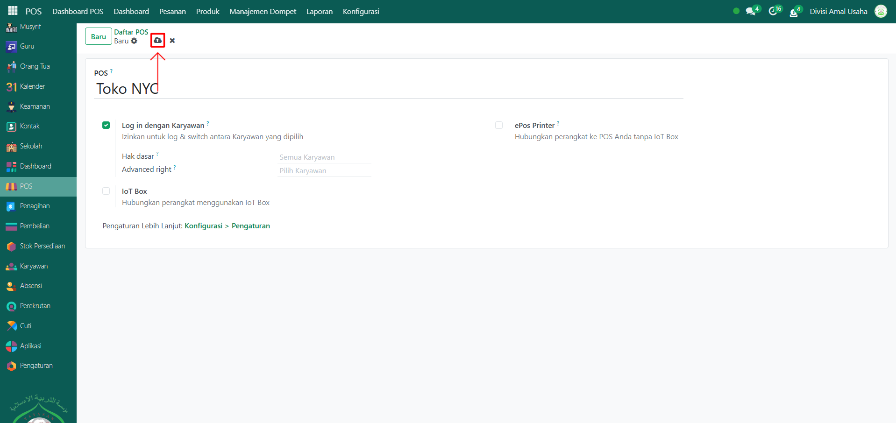

# Sesi Point of Sale

Video \[]

## Membuat Sesi POS

Sesi POS adalah konfigurasi pada modul **Point of Sale** yang digunakan untuk membuat dan mengatur sesi kasir, sehingga transaksi penjualan bisa dicatat secara real-time. Melalui sesi POS ini, pengguna dapat menentukan nama POS, akses login kasir, serta mengontrol jalannya transaksi.

### Langkah-langkah membuat sesi POS

1.  Buka **Modul POS**, lalu klik menu **Pengaturan** kemudian pilih submenu **POS**.

    <figure><figcaption></figcaption></figure>

2.  Klik tombol **"Baru"** untuk membuat sesi POS baru.

    <figure><figcaption></figcaption></figure>

3.  Akan tampil halaman form, isi inputan yang tersedia seperti:

    * **Nama POS** → misalnya _Toko NYC_.
    * **Log in dengan Karyawan** → aktifkan agar karyawan bisa login ke sesi POS.

    <figure><figcaption></figcaption></figure>

4.  Lalu klik icon **Simpan** di sebelah kanan icon **Gear** agar sesi POS tersimpan di sistem.

    <figure><figcaption></figcaption></figure>

5. Sesi POS berhasil dibuat dan dapat digunakan untuk membuka transaksi penjualan di kasir.
