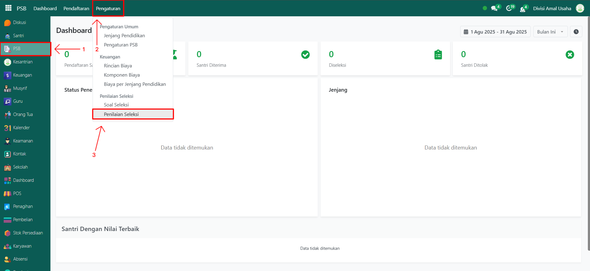
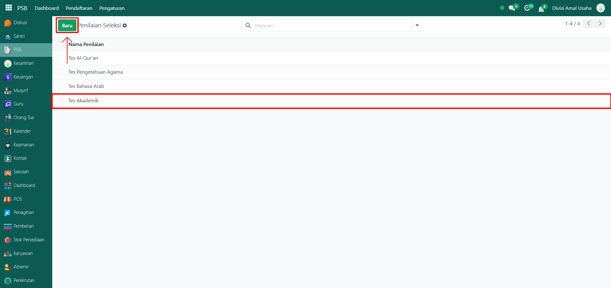
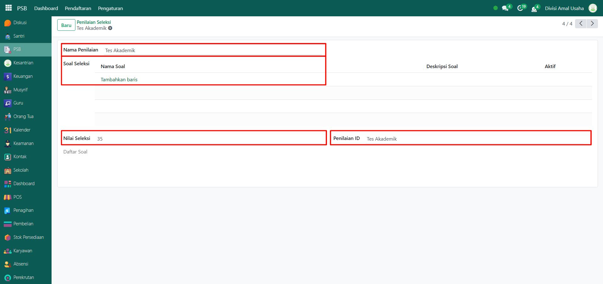
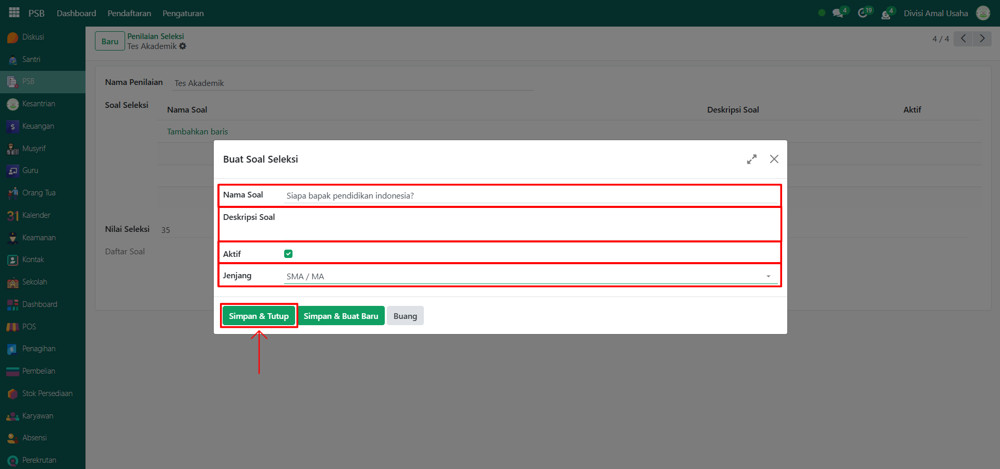
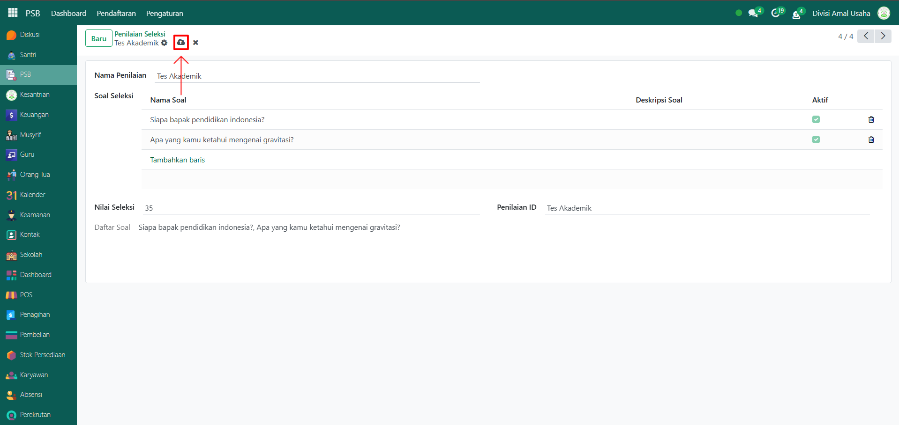

# Soal & Penilaian Seleksi

Video \[]

## Konfigurasi Soal & Penilaian PSB

Konfigurasi soal dan penilaian seleksi pada Odoo Pesantren digunakan untuk mengatur jenis tes seleksi serta soal-soal yang akan diberikan kepada calon santri. Data ini menjadi acuan dalam proses penerimaan santri baru, sehingga hasil seleksi bisa tercatat dan dinilai secara sistematis di sistem.

Berikut adalah langkah-langkah cara mengkonfigurasi soal & penilaian soal untuk pendaftaran santri baru.

1.  Buka **modul PSB**, lalu klik menu **Pengaturan** kemudian pilih submenu **Penilaian Seleksi**.

    <figure><figcaption></figcaption></figure>

2.  Pilih tipe penilaian seleksi yang sudah tersedia (misalnya: **Tes Akademik**) atau klik tombol **Baru** untuk membuat data penilaian seleksi baru.

    <figure><figcaption></figcaption></figure>

3.  Akan tampil halaman form, isi inputan yang tersedia seperti:

    * **Nama Penilaian** (misalnya: Tes Akademik).
    * **Soal Seleksi**, untuk menambahkan soal seleksi.
    * **Nilai Seleksi**, untuk mencatat skor hasil seleksi dari santri.
    * **Penilaian ID**, sebagai identitas dari penilaian seleksi tersebut.

    <figure><figcaption></figcaption></figure>

4. Untuk menambahkan soal seleksi, klik text "Tambahkan baris".&#x20;
5.  Lalu akan tampil form soal seleksi, isi inputan seperti:

    * Nama Soal
    * Deskripsi Soal
    * Centang kolom _Aktif_ jika soal ingin digunakan

    Klik tombol **"Simapn & Tutup"** untuk menyimpan soal seleksi.

    <figure><figcaption></figcaption></figure>

6.  Setelah semua inputan diisi dengan benar, klik **ikon Simpan** di sebelah kanan ikon Gear agar data penilaian seleksi beserta soal seleksinya tersimpan di sistem.

    <figure><figcaption></figcaption></figure>

7. Data berhasil disimpan dan dapat digunakan dalam proses seleksi penerimaan santri baru.
