# Struktur Organisasi

Video \[]

## Konfigurasi Struktur Organisasi

Struktur Organisasi pada Odoo Pesantren digunakan untuk membangun hierarki kerja di pesantren, mulai dari **Departemen**, **Jabatan Kerja**, hingga hubungan antara karyawan dengan manajernya. Dengan konfigurasi ini, pengguna dapat melihat secara visual **bagan organisasi** sehingga jelas siapa bertanggung jawab kepada siapa.

### Alur Konfigurasi Struktur Organisasi

Alur pembuatan struktur organisasi dimulai dari **membuat departemen**, kemudian dilanjutkan dengan **konfigurasi jabatan kerja**, setelah itu **mengaitkan jabatan pada karyawan**, dan terakhir **melihat bagan organisasi**.

#### A - Konfigurasi Departemen

Pertama-tama, buat departemen yang akan menjadi unit organisasi utama. Berikut langkah-langkahnya:

1.  Buka **modul Karyawan**, lalu klik menu **Departemen**.

    <figure>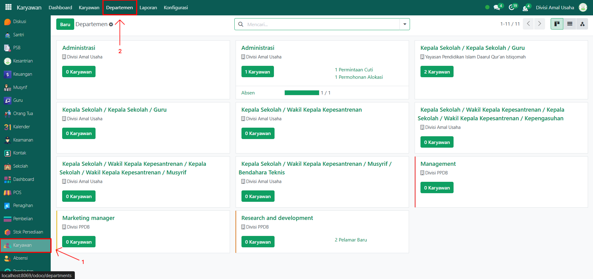<figcaption></figcaption></figure>

2.  Klik tombol **"Baru"** untuk membuat departemen baru.

    <figure><figcaption></figcaption></figure>

3.  Akan tampil halaman form, isi inputan seperti:

    * **Nama Departemen** (misalnya: Keamanan)
    * **Manajer** (misalnya: Administrator)
    * **Perusahaan** (misalnya: Divisi Sosial)

    <figure>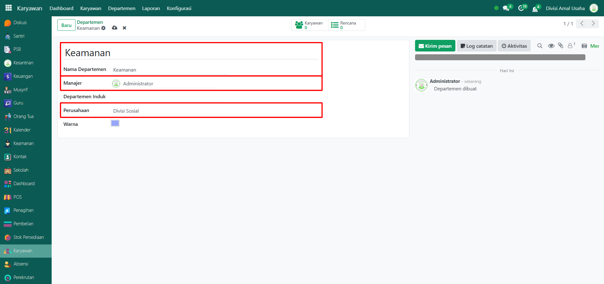<figcaption></figcaption></figure>

4.  Setelah semua inputan selesai diisi, klik icon **Simpan** di sebelah kanan icon Gear agar departemen tersimpan di sistem.

    <figure>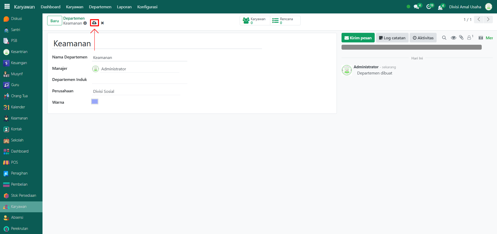<figcaption></figcaption></figure>

#### B - Konfigurasi Jabatan Kerja

Setelah departemen dibuat, langkah berikutnya adalah membuat jabatan kerja di dalam departemen tersebut. Berikut langkah-langkahnya:

1.  Pada modul yang sama, klik menu **Konfigurasi** lalu pilih submenu **Jabatan Kerja**.

    <figure>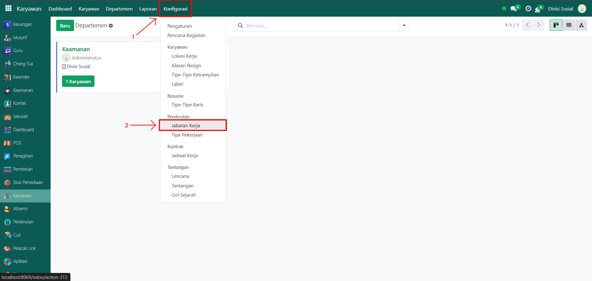<figcaption></figcaption></figure>

2. Anda bisa membuat jabatan kerja baru atau menggunakan jabatan yang sudah ada.
3.  Jika ingin membuat jabatan baru, klik tombol **"Baru"**.

    <figure>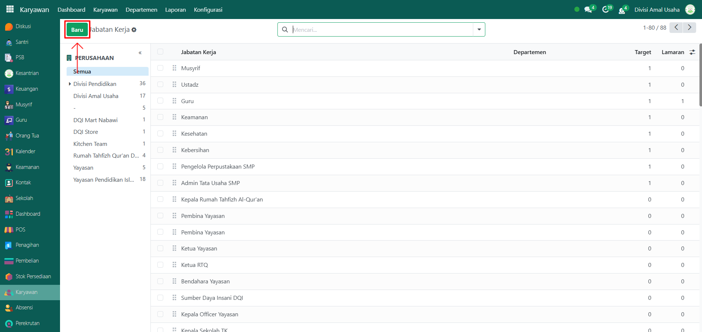<figcaption></figcaption></figure>

4.  Isi inputan form seperti:

    * **Nama Jabatan Kerja** (misalnya: Petugas Keamanan)
    * **Keterampilan** (opsional, misalnya: keamanan, kedisiplinan)
    * Lainnya sesuai kebutuhan.

    <figure>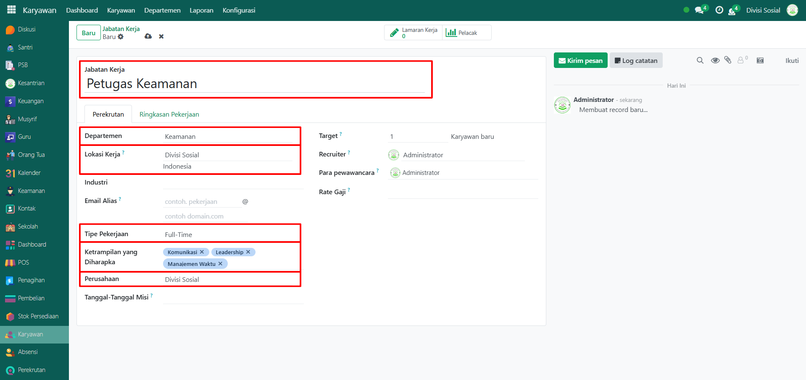<figcaption></figcaption></figure>

5.  Setelah semua inputan selesai diisi, klik icon **Simpan** agar jabatan kerja tersimpan di sistem.

    <figure>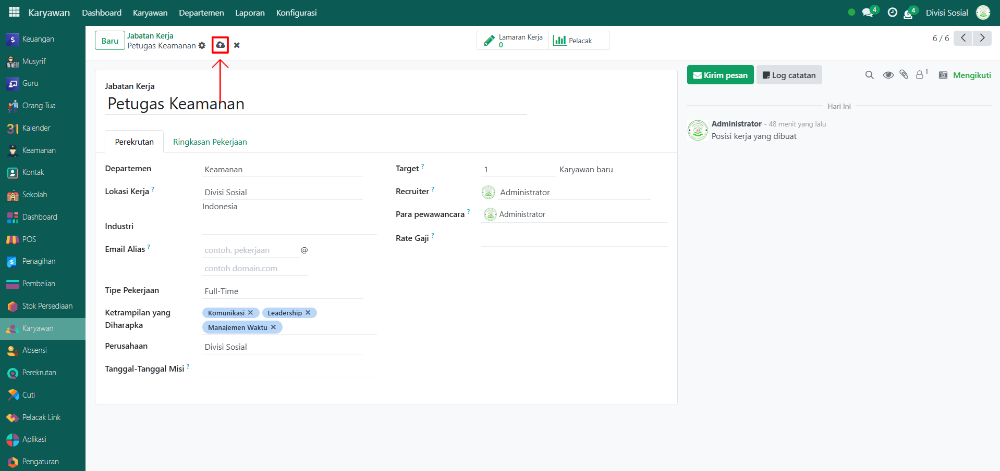<figcaption></figcaption></figure>

#### C - Konfigurasi Karyawan

Setelah jabatan tersedia, langkah selanjutnya adalah mengaitkan jabatan tersebut pada karyawan. Berikut langkah-langkahnya:

1.  Pada modul yang sama, klik menu **Karyawan**, lalu pilih submenu **Karyawan**.

    <figure>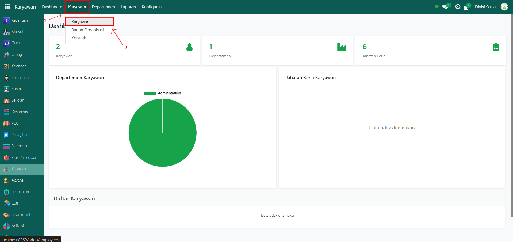<figcaption></figcaption></figure>

2.  Pilih karyawan yang ingin diberi jabatan sesuai departemen.

    <figure>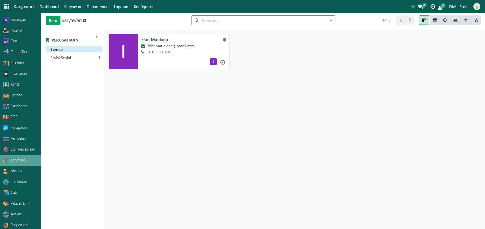<figcaption></figcaption></figure>

3.  Pada tampilan halaman form karyawan, tambahkan:

    * **Departemen** (misalnya: Keamanan)
    * **Jabatan Kerja** (misalnya: Petugas Keamanan)
    * **Manajer** → akan terisi otomatis jika departemen sudah memiliki manajer.

    <figure>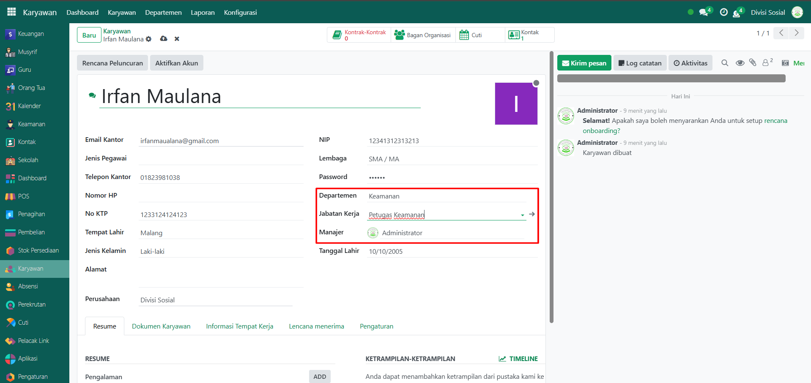<figcaption></figcaption></figure>

4.  Setelah semua inputan selesai diisi, klik icon **Simpan** agar perubahan konfigurasi karyawan tersimpan di sistem.

    <figure>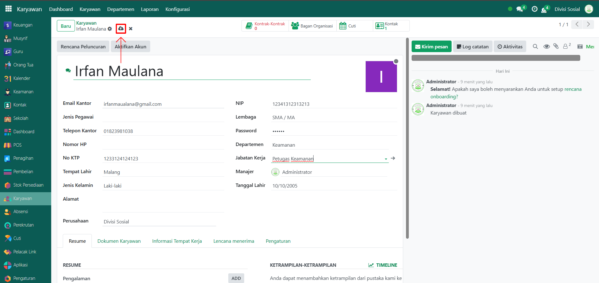<figcaption></figcaption></figure>

#### D - Bagan Organisasi

Setelah konfigurasi departemen, jabatan, dan karyawan selesai, sistem akan otomatis menyusun bagan organisasi. Untuk melihatnya, ikuti langkah berikut:

1.  Pada modul yang sama, klik menu **Karyawan**, lalu pilih submenu **Bagan Organisasi**.

    <figure>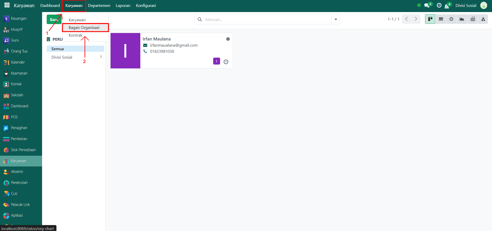<figcaption></figcaption></figure>

2.  Tampilan hierarki organisasi akan muncul secara visual dalam bentuk struktur pohon.

    <figure>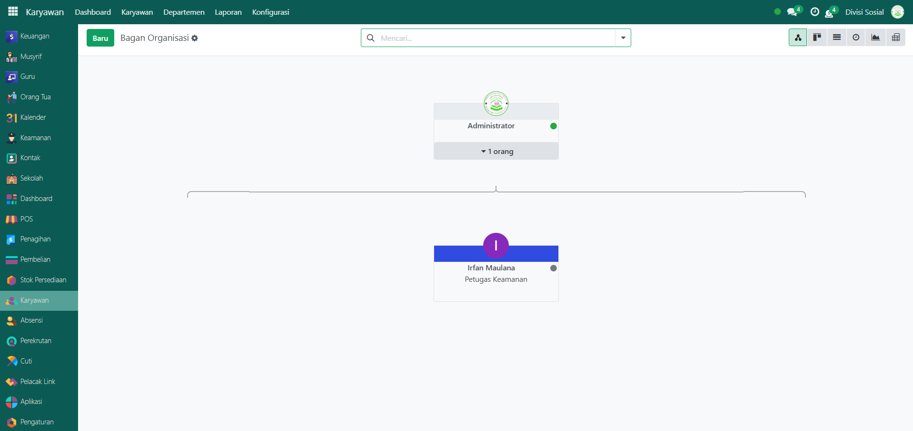<figcaption></figcaption></figure>

    Setiap kotak merepresentasikan seorang karyawan, jabatannya, dan hubungannya dengan manajer. Misalnya, _Irfan Maulana_ ditampilkan sebagai _Petugas Keamanan_ yang berada di bawah manajemen _Administrator_.
3. Anda bisa melakukan klik pada setiap kotak untuk melihat detail karyawan, termasuk departemen, jabatan, dan data terkait lainnya.

> Bagan ini membantu memantau struktur organisasi dan memastikan bahwa hubungan antar-karyawan sudah sesuai dengan hierarki yang dibuat.
