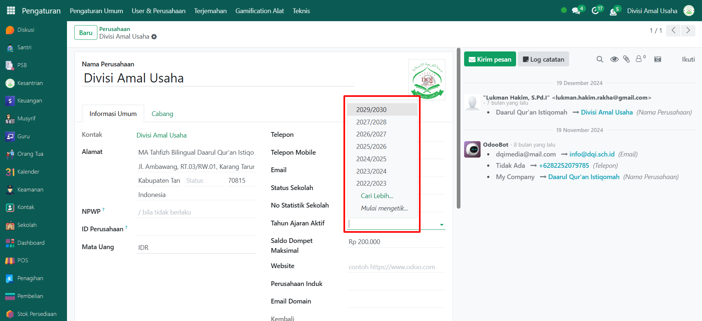

# Tahun Ajaran



## Tahun Ajaran Baru

**Tahun Ajaran** pada Odoo Pesantren digunakan sebagai acuan periode kegiatan belajar mengajar. Dengan adanya data Tahun Ajaran, sistem dapat mengatur jadwal akademik, periode tagihan, serta termin pembayaran sesuai dengan waktu yang berlaku di pesantren.

### Membuat Tahun Ajaran Baru

Berikut adalah langkah-langkah cara membuat tahun ajaran baru pada Odoo Pesantren.

1.  **Buka Modul Sekolah**, lalu klik menu **Pengaturan** kemudian pilih submenu **Tahun Ajaran**.

    <figure><figcaption></figcaption></figure>

2.  Klik tombol **“Baru”** untuk membuat tahun ajaran baru.

    <figure><figcaption></figcaption></figure>

3.  Pada halaman form, lakukan pengisian inputan secara berurutan:

    * **Tahun Ajaran** → contoh: 2029/2030.
    * **Pembagian Termin** → misalnya: Dua Semester.
    * **Tanggal Mulai** → isi tanggal awal periode akademik.
    * **Tanggal Selesai** → isi tanggal akhir periode akademik.
    * **Keterangan (Opsional)** → catatan tambahan jika diperlukan.

    <figure><figcaption></figcaption></figure>

4.  Setelah field utama terisi, Anda bisa klik tombol **Buat Termin Akademik** untuk secara otomatis menambahkan semester (misalnya semester 1 dan 2) pada tab Termin Akademik.

    <figure><figcaption></figcaption></figure>

5.  Kemudian klik tombol **Buat Periode Tagihan Bulanan** untuk membuat daftar periode tagihan bulanan sesuai tanggal tahun ajaran. Data ini akan muncul di tab Periode Tagihan.

    <figure><figcaption></figcaption></figure>

6.  Terakhir, klik icon **Simpan** di sebelah kanan icon **Gear** agar tahun ajaran baru tersimpan di sistem.

    <figure><figcaption></figcaption></figure>

7. Data Tahun Ajaran baru akan tersimpan dan dapat digunakan untuk seluruh kegiatan akademik.

## Aktifkan Tahun Ajaran

Agar tahun ajaran yang sudah dibuat dapat digunakan secara aktif di seluruh modul yang berhubungan dengan akademik dan keuangan, perlu dilakukan konfigurasi pada induk perusahaan di Odoo Pesantren.

### Mengaktifkan Tahun Ajaran

Berikut adalah langkah-langkah untuk mengaktifkan tahun ajaran di induk perusahaan yang dipakai pada Odoo Pesantren.

1.  Buka menu **Pengaturan**, lalu klik **User & Perusahaan** dan pilih submenu **Perusahaan**.

    <figure><figcaption></figcaption></figure>

2.  Pilih salah satu perusahaan induk yang digunakan di pesantren.

    <figure><figcaption></figcaption></figure>

3.  Pada halaman form perusahaan, cari field **Tahun Ajaran Aktif**, kemudian pilih tahun ajaran yang telah dibuat sebelumnya.

    <figure><figcaption></figcaption></figure>

4.  Setelah semua inputan diisi dengan benar, klik ikon **Simpan** di sebelah kanan ikon **Gear** agar konfigurasi tahun ajaran aktif di sistem.

    <figure><figcaption></figcaption></figure>

5. Tahun ajaran yang dipilih kini sudah aktif pada induk perusahaan, sehingga akan otomatis menjadi acuan utama dalam modul akademik, keuangan, maupun kegiatan operasional lain di pesantren.
