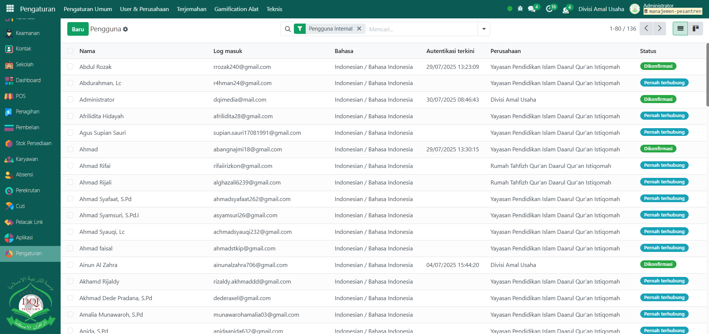

# Administrator

Video \[]

## Role Administrator

**Administrator** adalah peran tertinggi dalam sistem Odoo yang memberikan akses penuh kepada pengguna untuk mengelola seluruh modul, konfigurasi, dan data di dalam sistem. Pengguna dengan role ini dapat melihat dan mengatur semua bagian, termasuk data bisnis (seperti penjualan, inventaris, keuangan) serta menu teknis seperti model, field, dan tampilan (views).&#x20;

Role Administrator biasanya diberikan kepada pemilik sistem, administrator IT, atau developer yang bertanggung jawab atas pengelolaan dan pengembangan aplikasi. Dengan akses ini, mereka dapat menambahkan atau menghapus pengguna, mengatur hak akses, mengaktifkan mode pengembang (Developer Mode), serta menginstal atau memperbarui modul. Karena memiliki kontrol penuh terhadap sistem, peran ini sebaiknya hanya diberikan kepada pihak yang benar-benar memahami struktur dan fungsionalitas Odoo, agar menghindari kesalahan konfigurasi atau perubahan data yang bisa berdampak serius pada operasional perusahaan.

## Hak Akses Administrator

Pengguna dengan role Administrator dapat:

Mengakses seluruh aplikasi dan modul tanpa batas.

1. Mengelola semua pengguna dan grup akses.
2. Mengaktifkan Developer Mode.
3. Melihat dan memodifikasi Models, Fields, Views, Actions.
4. Melakukan instalasi, update, atau penghapusan modul.
5. Mengatur backup, restore, dan konfigurasi server/email.

## Kapan Role Ini Digunakan?

Role ini diberikan jika:

1. Pengguna bertanggung jawab penuh atas sistem (pemilik/pengelola sistem).
2. Pengguna merupakan tim IT yang mengelola akses dan pengaturan.

## Cara memberikan role Administrator

Berikut adalah langkah-langkah untuk memberikan role Administrator:

1.  Masuk ke Odoo sebagai Administrator, Jika Anda belum memahami cara login sebagai admin, silakan lihat panduan [**Login Admin** di sini](../../panduan-login/login-admin.md).

    <figure><figcaption></figcaption></figure>

2.  Buka Pengaturan → User & Perusahaan → Pengguna.

    <figure><figcaption></figcaption></figure>

3.  Pilih pengguna yang ingin diberi role Administrator.

    <figure><figcaption></figcaption></figure>

4.  Pada tab Hak Akses, ubah level akses modul menjadi Administrator (misal: POS → Administrator dan Stok Persediaan → Administrator).

    <figure><figcaption></figcaption></figure>

5.  Lalu klik icon **Simpan** di sebelah kanan icon **Gear** agar perubahan konfigurasi tersimpan di sistem.

    <figure><figcaption></figcaption></figure>

## Cara memberikan role tertentu kepada User

Berikut adalah langkah-langkah untuk memberikan role tertentu kepada user.

1.  Masuk ke Odoo sebagai Administrator. Jika Anda belum memahami cara login sebagai admin, silakan lihat panduan [**Login Admin** di sini](../../panduan-login/login-admin.md).

    <figure><figcaption></figcaption></figure>

2.  Buka Pengaturan → User & Perusahaan → Pengguna.

    <figure><figcaption></figcaption></figure>

3.  Pilih pengguna yang ingin diberi role.

    <figure><figcaption></figcaption></figure>

4.  Pada tab Hak Akses, ubah level akses modul menjadi role yang akan diberikan (misal: Centang bagian Orang Tua apabila akunnya adalah akun untuk orang tua).

    <figure><figcaption></figcaption></figure>

5.  Lalu klik icon **Simpan** di sebelah kanan icon **Gear** agar perubahan konfigurasi tersimpan di sistem.

    <figure><figcaption></figcaption></figure>


Tips Keamanan:

1. Hanya berikan role Administrator pada orang yang dipercaya dan kompeten.
2. Gunakan akun terpisah khusus Administrator.
3. Audit secara berkala siapa saja yang memiliki role ini.

