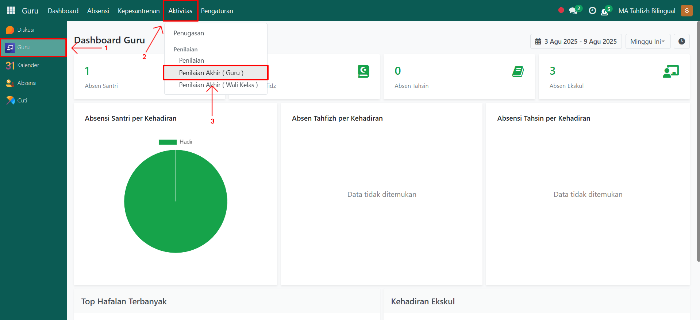
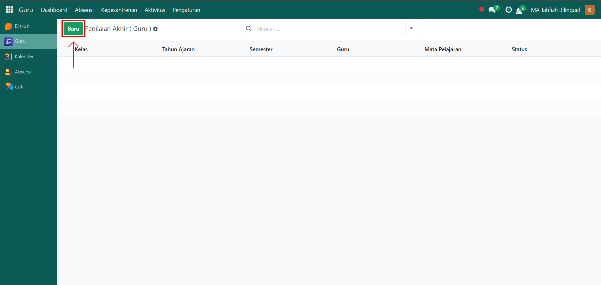
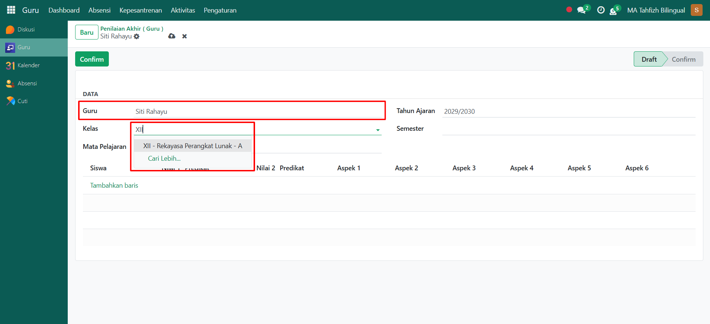
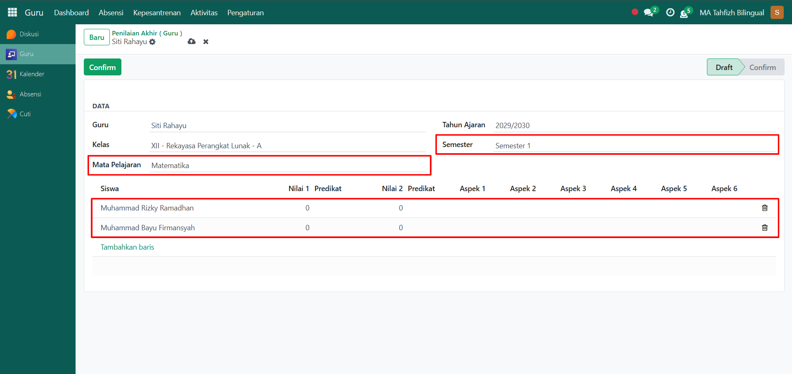
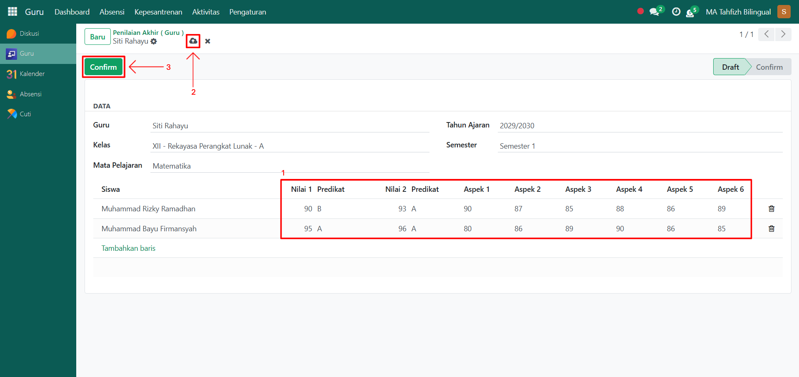

# Penilaian Akhir (Guru)

Video \[]

## Penilaian Akhir (Guru)

**Penilaian Akhir (Guru)** digunakan oleh guru akademik untuk mengisi nilai rapor akhir santri, dengan mempertimbangkan berbagai aspek penilaian (nilai harian, tugas, UTS, UAS, dan aspek sikap/kompetensi lainnya). Sistem akan otomatis menyesuaikan **predikat** sesuai konfigurasi predikat nilai yang sudah dibuat sebelumnya.

### Melakukan Penilaian Akhir oleh Guru Akademik

Berikut adalah langkah-langkah untuk melakukan penilaian akhir (guru) pada Odoo Pesantren oleh **guru akademik**.

1. Login menggunakan akun guru akademik. Jika Anda belum memahami cara login sebagai guru akademik, silakan lihat panduan [**Login Guru Akademik** di sini](../../../setup-and-konfigurasi/role-and-hak-akses-pengguna/panduan-login/login-guru.md).
2.  Buka modul **Guru**, lalu klik menu **Aktivitas** dan pilih submenu **Penilaian Akhir (Guru)**.

    <figure><figcaption></figcaption></figure>

3.  Klik tombol **Baru** untuk membuat penilaian akhir baru.

    <figure><figcaption></figcaption></figure>

4.  Akan tampil halaman form **Penilaian Akhir (Guru)**. Pada form ini, isi **Guru** yang sedang melakukan penilaian akhir, lalu pilih **Kelas** yang akan dinilai.

    <figure><figcaption></figcaption></figure>

5.  Selanjutnya, isi inputan lainnya seperti:

    * **Mata Pelajaran** (misalnya: Matematika)
    * **Semester** (misalnya: 1 / 2)

    <figure><figcaption></figcaption></figure>

6.  Pada bagian bawah form terdapat **list table santri**, yang menampilkan semua santri dalam kelas tersebut. Untuk setiap santri, isi:

    * **Nilai 1** (misalnya: nilai tugas)
    * **Nilai 2** (misalnya: nilai ujian)
    * **Aspek 1 – 6** (misalnya: kedisiplinan, partisipasi, keterampilan, dll sesuai kebijakan sekolah)
    * **Predikat** akan otomatis terisi sesuai data predikat nilai yang sudah dikonfigurasi.

    Setelah semua inputan diisi dengan benar, klik ikon **Simpan** di sebelah kanan ikon Gear agar data penilaian akhir tersimpan dengan status **Draft**. Setelah itu, klik tombol **"Confirm"** untuk mengonfirmasi bahwa proses penilaian akhir sudah selesai.

    <figure><figcaption></figcaption></figure>

7. Data penilaian akhir akan tersimpan secara permanen dan bisa digunakan untuk rapor santri.
