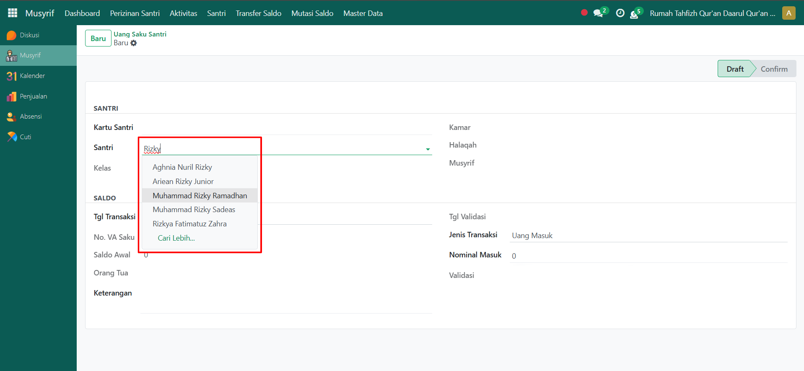
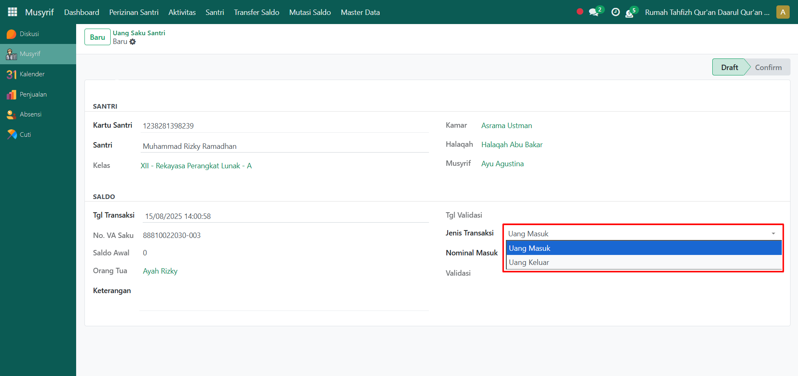

# Uang Saku Santri

Video \[]

## Uang Saku Santri

**Uang Saku Santri** digunakan untuk mencatat pengisian maupun pengeluaran saldo dompet santri. Dengan adanya pencatatan ini, transaksi uang saku dapat dikelola secara transparan dan terdokumentasi dengan baik sehingga memudahkan dalam pengawasan serta pelaporan keuangan santri.

### Melakukan Transaksi Uang Saku Santri

Berikut adalah langkah-langkah untuk melakukan transaksi uang saku santri pada Odoo Pesantren sebagai **musyrif**.

1. Login menggunakan akun musyrif. Jika Anda belum memahami cara login sebagai musyrif, silakan lihat panduan [**Login Musyrif** di sini](../../setup-and-konfigurasi/role-and-hak-akses-pengguna/panduan-login/login-musyrif.md).
2.  Buka modul **Musyrif**, lalu klik menu **Santri** kemudian pilih submenu **Uang Saku Santri**.

    <figure><figcaption></figcaption></figure>

3.  Klik tombol **"Baru"** untuk melakukan transaksi uang saku santri.

    <figure><figcaption></figcaption></figure>

4.  Halaman form transaksi uang saku akan ditampilkan. Pilih **santri** yang akan dilakukan pengisian atau pengeluaran saldo dompet.

    <figure><figcaption></figcaption></figure>

5.  Masukkan **tanggal transaksi**. Secara default, sistem akan otomatis menyesuaikan dengan tanggal saat transaksi dibuat.

    <figure><figcaption></figcaption></figure>

6.  Pada kolom **Jenis Transaksi**, pilih tipe transaksi yang dilakukan, misalnya _Uang Masuk_ (pengisian saldo) atau _Uang Keluar_ (pengeluaran saldo).

    <figure><figcaption></figcaption></figure>

7.  Masukkan **nominal saldo** sesuai transaksi yang dilakukan. Jika diperlukan, tambahkan **keterangan** untuk memperjelas transaksi.

    <figure><figcaption></figcaption></figure>

8. Setelah semua data diisi, klik icon **Simpan**. Transaksi akan tersimpan dengan status **Draft**.
9. Selanjutnya, transaksi uang saku tersebut akan diteruskan kepada **Administrator** atau pihak berwenang untuk dilakukan proses **Konfirmasi**, sehingga status berubah menjadi _Confirm_ dan transaksi resmi tercatat dalam sistem.
