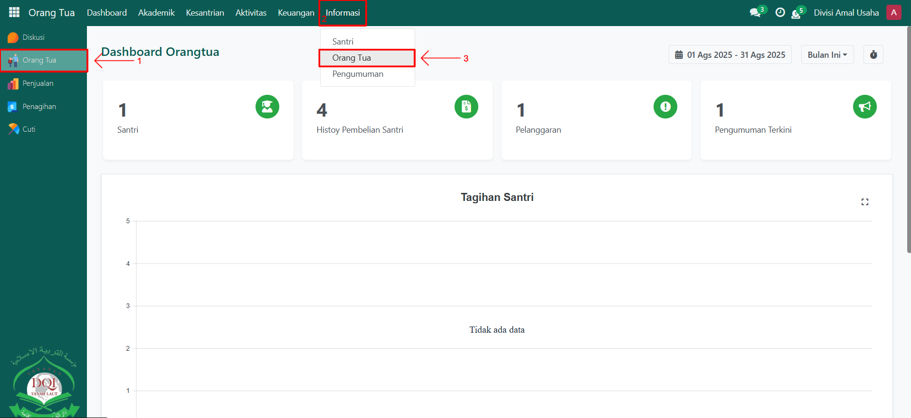
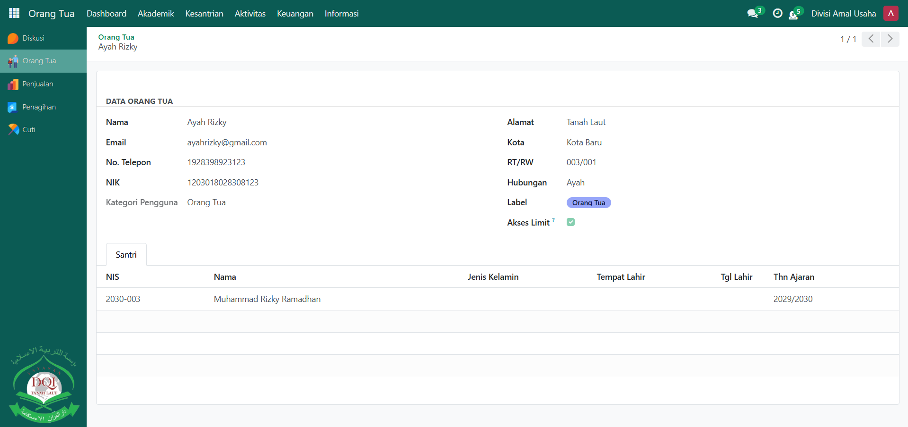

# Cek Informasi Data Orang Tua

Video \[]

## Cek Informasi Data Orang Tua

Fitur **Cek Informasi Orang Tua** digunakan oleh **Orang Tua** untuk melihat dan memastikan data pribadi mereka yang terdaftar di sistem Odoo Pesantren. Data ini biasanya berisi informasi identitas dasar, alamat, pekerjaan, serta keterhubungan dengan santri. Dengan fitur ini, orang tua dapat memantau apakah data mereka sudah benar sesuai pendaftaran.

### Mengecek Informasi  Data Orang Tua oleh Orang Tua

Berikut adalah langkah-langkah untuk mengecek informasi data orang tua pada Odoo Pesantren sebagai **orang tua**.

1. Login menggunakan akun orang tua. Jika Anda belum memahami cara login sebagai orang tua, silakan lihat panduan [**Login Orang Tua** di sini](../../../setup-and-konfigurasi/role-and-hak-akses-pengguna/panduan-login/login-orang-tua.md).
2.  Buka modul **Orang Tua**, lalu klik menu **Informasi** dan pilih submenu **Orang Tua**.

    <figure><figcaption></figcaption></figure>

3.  Pada halaman **Orang Tua**, sistem akan menampilkan data orang tua yang sedang login saat ini. Klik data orang tua tersebut untuk melihat detail informasi lebih lanjut, seperti **nama lengkap, alamat, nomor telepon, serta keterhubungan dengan santri**.

    <figure><figcaption></figcaption></figure>

4.  Data ini hanya bersifat **read-only**, sehingga orang tua tidak dapat mengubahnya secara langsung. Jika ada data yang kurang sesuai, orang tua dapat menghubungi administrator pesantren untuk melakukan perbaikan data.

    <figure><figcaption></figcaption></figure>
