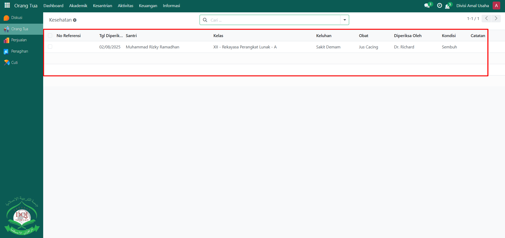
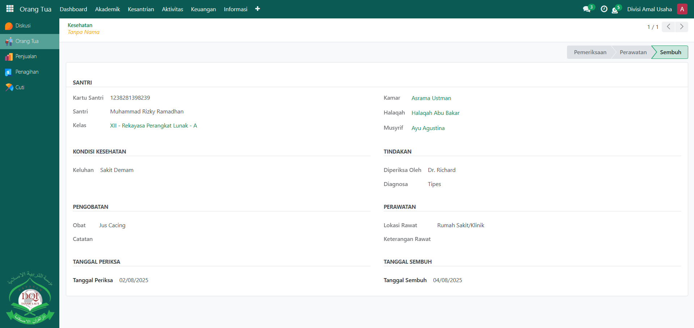

# Kesehatan Santri

Video \[]

## Monitoring Kesehatan Santri

**Monitoring Kesehatan Santri** digunakan oleh **Orang Tua** untuk memantau kondisi kesehatan anaknya yang dicatat oleh musyrif atau administrator pesantren. Dengan fitur ini, orang tua dapat mengetahui riwayat pemeriksaan kesehatan, keluhan, tindakan medis, serta perkembangan kesehatan anak secara transparan.

### Memonitoring Kesehatan Santri sebagai Orang Tua

Berikut adalah langkah-langkah untuk memonitoring kesehatan santri pada Odoo Pesantren sebagai **orang tua**.

1. Login menggunakan akun orang tua. Jika Anda belum memahami cara login sebagai orang tua, silakan lihat panduan [**Login Orang Tua** di sini](../../../setup-and-konfigurasi/role-and-hak-akses-pengguna/panduan-login/login-orang-tua.md).
2.  Buka modul **Orang Tua**, lalu klik menu **Aktivitas** dan pilih submenu **Kesehatan**.

    <figure><figcaption></figcaption></figure>
3.  Pada halaman **Kesehatan**, sistem akan menampilkan daftar catatan kesehatan santri dari anak Anda yang sudah dicatat oleh musyrif atau administrator. Klik salah satu data untuk melihat informasi lebih detail mengenai kondisi kesehatan santri, seperti **keluhan, diagnosa, tindakan pemeriksaan, obat/perawatan, catatan ustadz/tenaga medis, serta status kesembuhan**.

    <figure><figcaption></figcaption></figure>

4.  Orang tua dapat memanfaatkan informasi ini untuk memantau perkembangan kesehatan anak dan melakukan tindak lanjut bila diperlukan.

    <figure><figcaption></figcaption></figure>
