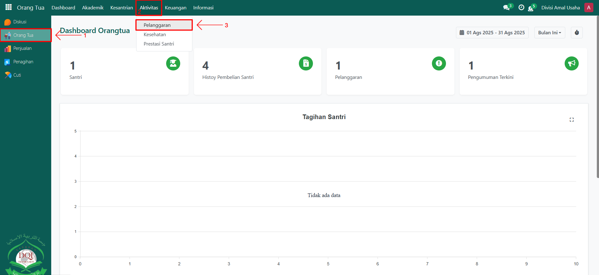
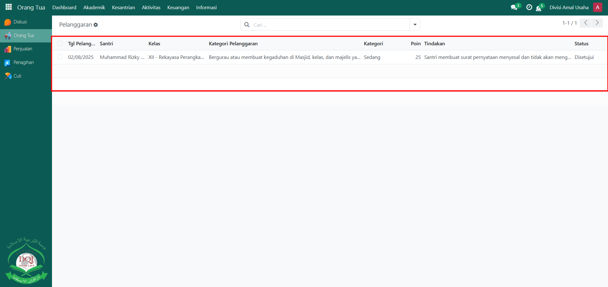
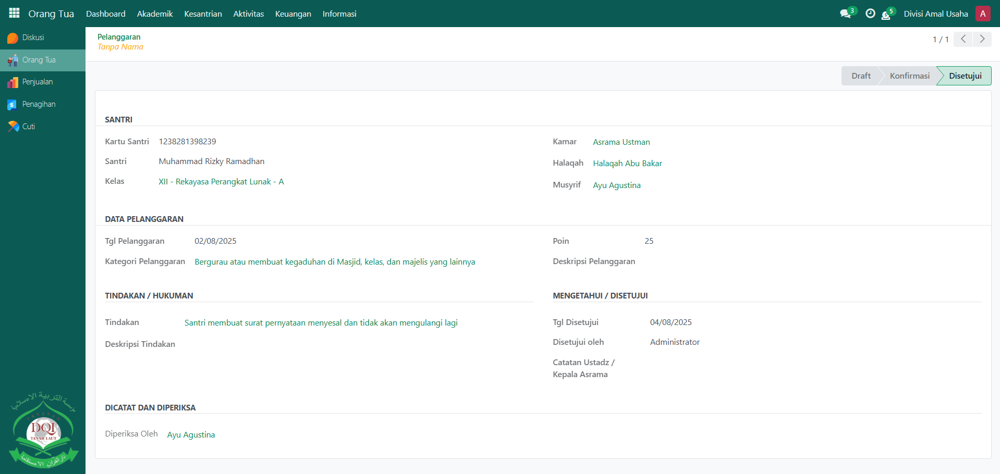

# Pelanggaran Santri

Video \[]

## Monitoring Pelanggaran Santri

**Monitoring Pelanggaran Santri** digunakan oleh **Orang Tua** untuk memantau catatan pelanggaran disiplin anaknya yang dicatat oleh musyrif atau pihak pesantren. Dengan adanya fitur ini, orang tua dapat mengetahui jenis pelanggaran, poin pelanggaran, serta tindak lanjut yang diberikan kepada santri.

### Memonitoring Pelanggaran Santri sebagai Orang Tua

Berikut adalah langkah-langkah untuk memonitoring pelanggaran santri pada Odoo Pesantren sebagai **orang tua**.

1. Login menggunakan akun orang tua. Jika Anda belum memahami cara login sebagai orang tua, silakan lihat panduan [**Login Orang Tua** di sini](../../../setup-and-konfigurasi/role-and-hak-akses-pengguna/panduan-login/login-orang-tua.md).
2.  Buka modul **Orang Tua**, lalu klik menu **Aktivitas** dan pilih submenu **Pelanggaran**.

    <figure><figcaption></figcaption></figure>

3.  Pada halaman **Pelanggaran**, sistem akan menampilkan daftar pelanggaran yang pernah dicatat oleh musyrif terhadap anak Anda. Klik salah satu data untuk melihat informasi lebih detail, seperti **kategori pelanggaran, tanggal pelanggaran, poin, deskripsi pelanggaran, tindakan disiplin, dan catatan ustadz/kepala asrama**.

    <figure><figcaption></figcaption></figure>

4.  Orang tua dapat menggunakan informasi ini untuk melakukan evaluasi dan memberikan bimbingan lebih lanjut kepada anaknya di rumah.

    <figure><figcaption></figcaption></figure>
