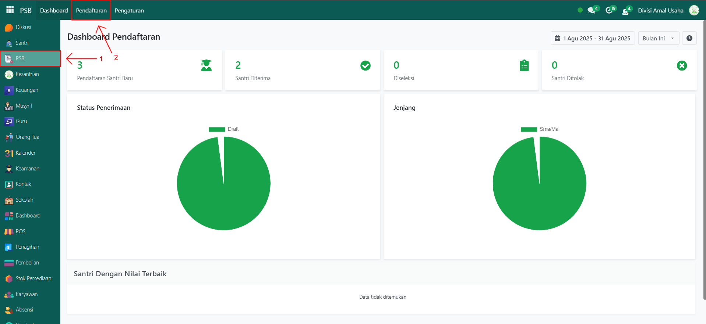
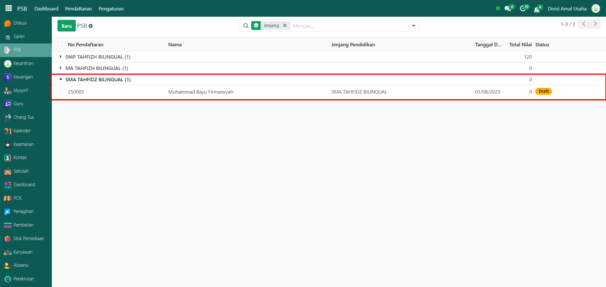
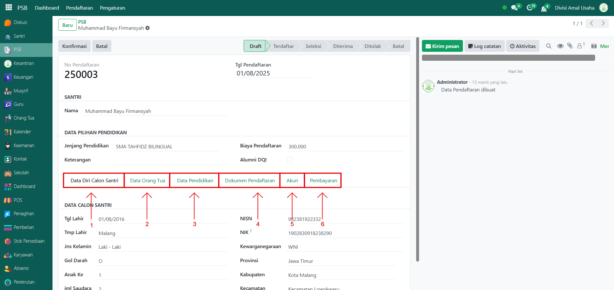
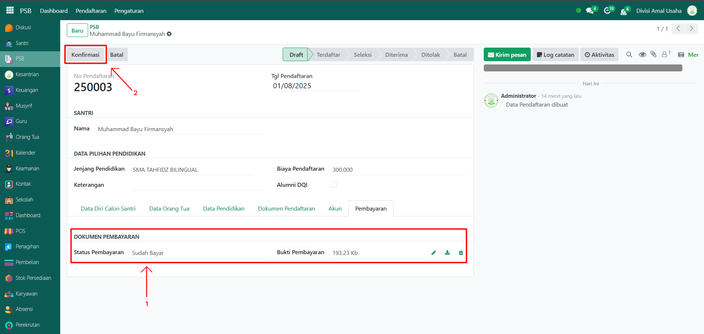
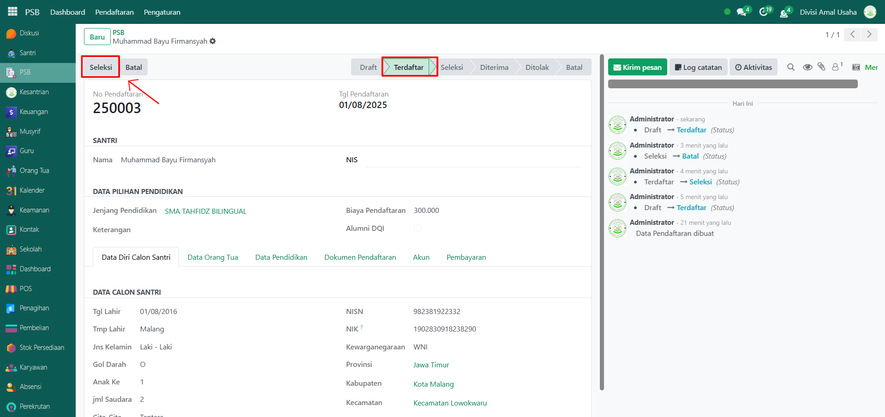
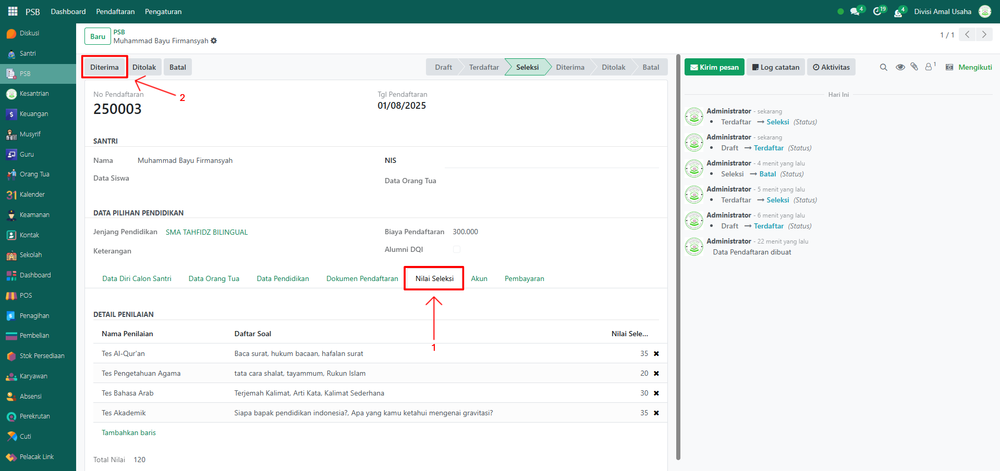
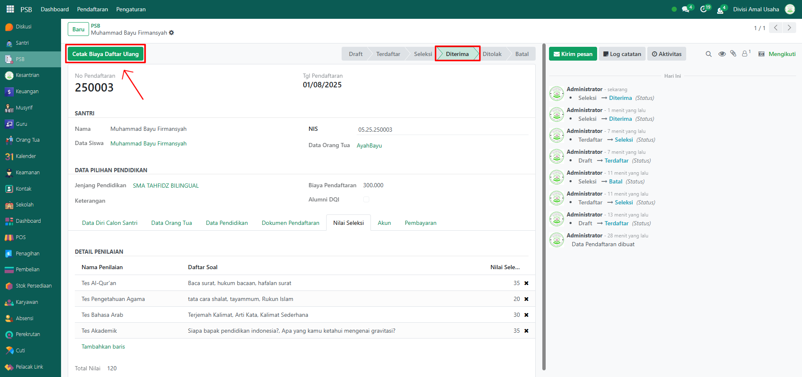

# Kelola Pendaftaran Santri

Video \[]

## Kelola Pendaftaran Santri

Fitur ini digunakan oleh administrator untuk mengelola proses pendaftaran santri baru yang diajukan melalui website PSB Odoo Pesantren. Administrator dapat memverifikasi data calon santri, memantau status pendaftaran, melakukan seleksi, hingga menentukan hasil akhir diterima atau ditolak.

### Mengelola Pendaftaran Santri

Berikut adalah langkah-langkah untuk mengelola pendaftaran santri yang telah terdata di sisitem pada Odoo Pesantren.

1. Login menggunakan akun administrator. Jika Anda belum memahami cara login sebagai admin, silakan lihat panduan [**Login Admin** di sini](../../panduan-login/login-admin.md).
2.  Buka modul **PSB**, lalu klik menu **Pendaftaran** untuk mulai mengelola daftar pendaftaran yang telah diajukan oleh calon santri.

    <figure><figcaption></figcaption></figure>

3. Sistem akan menampilkan daftar calon santri yang mendaftar melalui website PSB yaitu [aplikasi.dqi.ac.id](https://aplikasi.dqi.ac.id/psb)
4.  Klik salah satu pendaftar untuk melihat informasi detail. Misalnya, pada jenjang **SMA Tahfidz Bilingual** terdapat 1 pendaftar baru dengan status **Draft**.

    <figure><figcaption></figcaption></figure>

5.  Akan muncul form detail pendaftaran berisi data calon santri, orang tua, pendidikan sebelumnya, dokumen pendaftaran, akun santri, dan pembayaran.

    <figure><figcaption></figcaption></figure>

6. Kenali Status Pendaftaran:

| Status        | Informasi                                                                                  |
| ------------- | ------------------------------------------------------------------------------------------ |
| Batal         | Pendaftaran dibatalkan oleh peserta atau sistem.                                           |
| **Draft**     | Pendaftaran masih berupa draft; calon santri belum melakukan pembayaran biaya pendaftaran. |
| **Terdaftar** | Pendaftaran sudah berhasil, data calon santri telah dikonfirmasi oleh pesantren.           |
| **Seleksi**   | Calon santri masuk tahap seleksi (tes baca Al-Qur’an, wawancara, atau tes lainnya).        |
| **Diterima**  | Calon santri dinyatakan diterima karena memenuhi persyaratan.                              |
| **Ditolak**   | Calon santri ditolak karena tidak memenuhi kriteria.                                       |

7.  Klik tombol **"Konfirmasi"** jika calon santri sudah melakukan pembayaran. Namun, jika ingin membatalkan calon santri -> klik tombol **"Batal"**.

    <figure><figcaption></figcaption></figure>

8.  Setelah konfirmasi, status akan berubah menjadi **Terdaftar**. Untuk melanjutkan proses, klik tombol "**Seleksi"**.

    <figure><figcaption></figcaption></figure>

9.  Akan muncul tab baru bernama **Nilai Seleksi**. Masuk ke tab ini, lalu tambahkan penilaian sesuai kriteria, misalnya:  Tes Al-Qur’an, Pengetahuan Agama, Bahasa Arab, dan Tes Akademik. Jika santri memenuhi kriteria, klik tombol "**Diterima"**. Namun, jika santri tidak memenuhi kriteria, klik tombol **Ditolak**.

    <figure><figcaption></figcaption></figure>

10. Setelah calon santri dinyatakan **Diterima**, sistem akan menampilkan tombol "**Cetak Biaya Daftar Ulang"**. Tombol ini digunakan untuk mencetak rincian biaya daftar ulang santri.

    <figure><figcaption></figcaption></figure>

11. Data pendaftaran santri sudah lengkap dan tersimpan di sistem. Calon santri yang diterima akan resmi masuk ke tahap berikutnya dalam manajemen santri pesantren.
