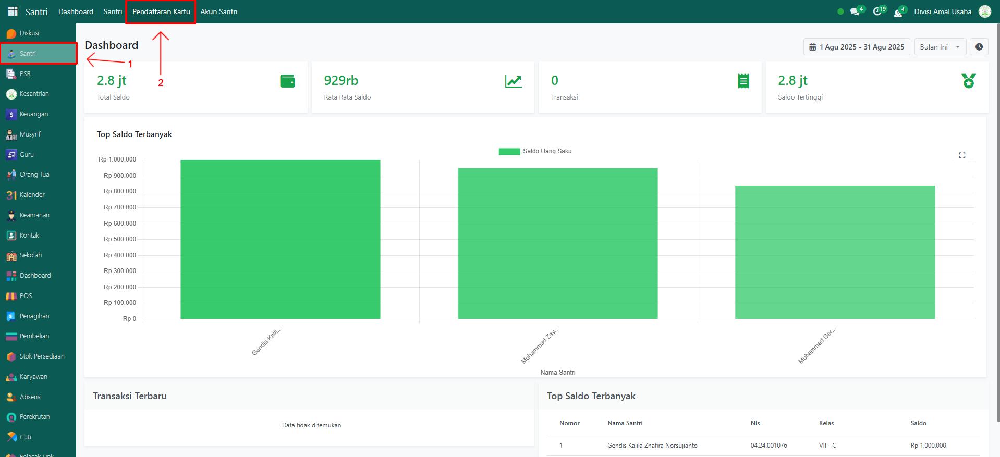
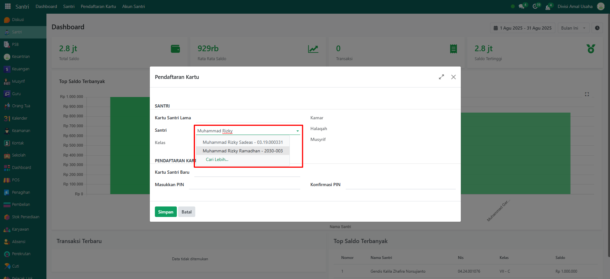
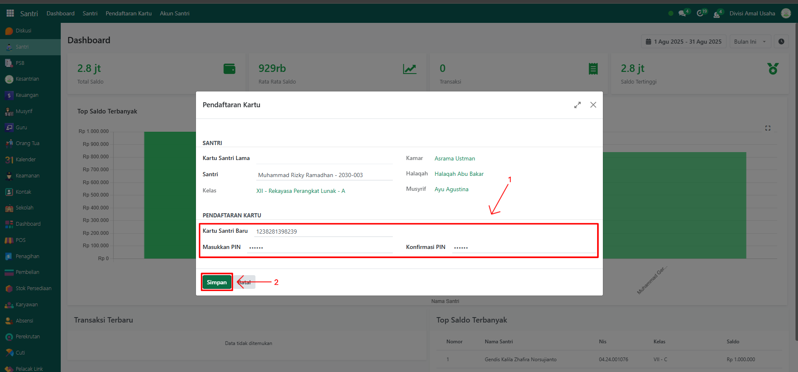
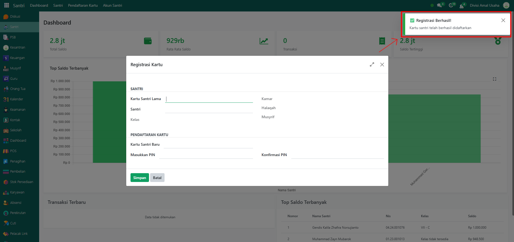
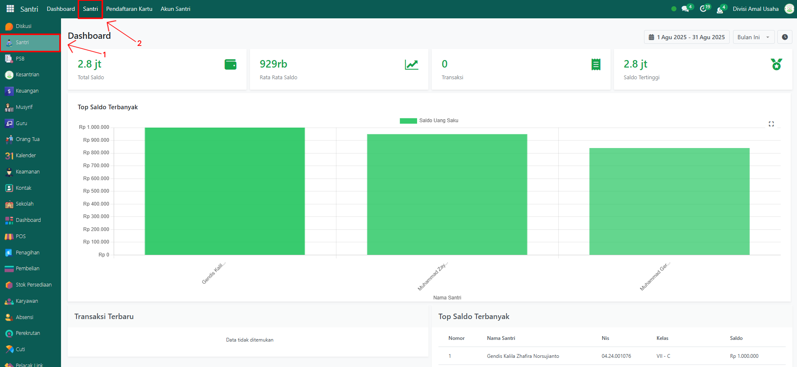
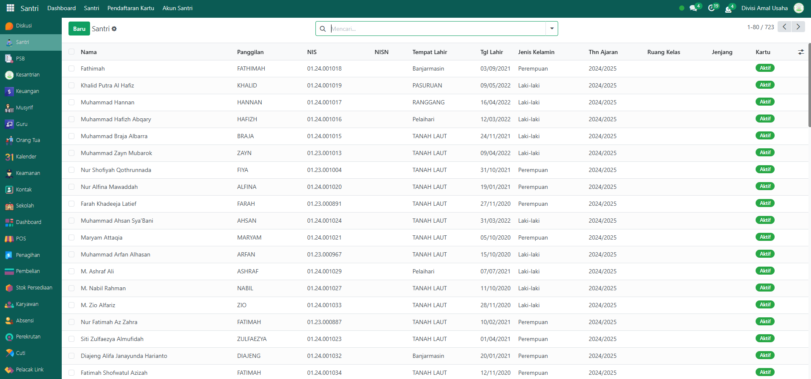
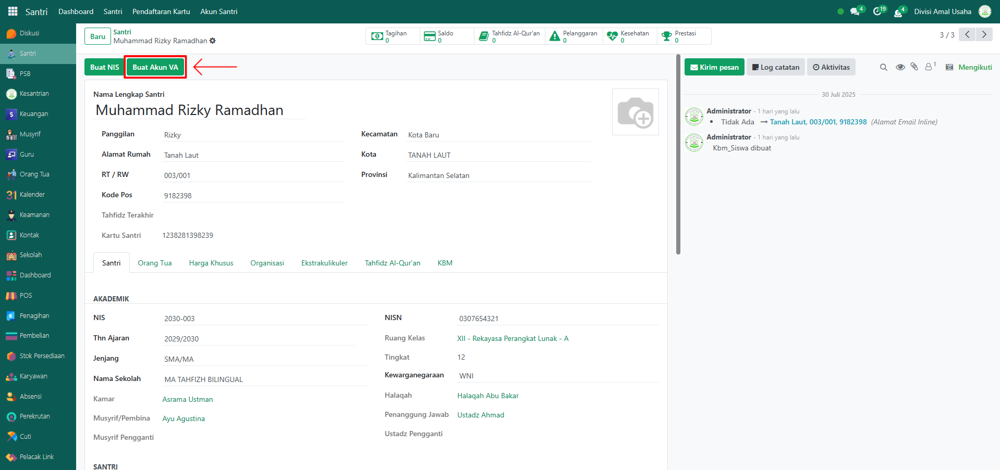
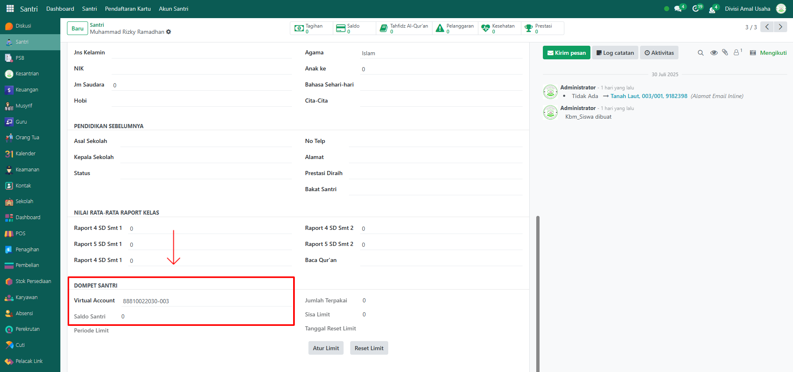

# Pendaftaran Kartu dan VA

Video \[]

## Pendaftaran Kartu Santri

Fitur **Pendaftaran Kartu Santri** pada aplikasi Odoo Pesantren digunakan untuk mendaftarkan atau mengganti kartu identitas elektronik yang dimiliki santri. Kartu ini digunakan untuk berbagai keperluan, seperti absensi, akses ke ruang atau fasilitas tertentu, aktivitas pembayaran dan kehadiran, dan otentikasi PIN santri. Fitur ini juga mendukung penggantian kartu lama ke kartu baru, disertai validasi PIN untuk keamanan.&#x20;

### Langkah-Langkah Mendaftarkan Kartu Santri

Berikut adalah langkah-langkah untuk pendaftaran atau penggantian Kartu Santri:

1. Login menggunakan akun administrator. Jika Anda belum memahami cara login sebagai admin, silakan lihat panduan [**Login Admin** di sini](../../panduan-login/login-admin.md).
2.  Buka modul **Santri** dan buka menu **Pendaftaran Kartu**.

    <figure><figcaption></figcaption></figure>

3.  Masukkan nama santri pada bagian **Santri**. Jika akan dilakukan pembuatan kartu, maka field **Kartu Santri Lama** tidak akan terisi.

    <figure><figcaption></figcaption></figure>

4.  Isi kolom **Kartu Santri Baru** meliputi nomor kartu, PIN dan konfirmasi PIN.

    <figure><figcaption></figcaption></figure>

5. Klik tombol **"Simpan"**, maka sistem akan menyimpan perubahan dan mengaktifkan kartu baru.
6.  Sistem akan menampilkan notifikasi bahwa registrasi kartu santri berhasil.

    <figure><figcaption></figcaption></figure>

### Langkah-Langkah Membuat VA (Virtual Account) Santri

Berikut adalah langkah-langkah membuat VA (Virtual Account) untuk Santri pada Odoo Pesantren.

1. Login menggunakan akun administrator. Jika Anda belum memahami cara login sebagai admin, silakan lihat panduan [**Login Admin** di sini](../../panduan-login/login-admin.md).
2.  Pada modul yang sama, klik menu **Santri**.

    <figure><figcaption></figcaption></figure>

3.  Pilih salah satu data santri yang akan dibuatkan Akun VA.

    <figure><figcaption></figcaption></figure>

4.  Pada halaman form santri, klik tombol **"Buat Akun VA"** untuk membuat akun virtual santri yang dipilih.

    <figure><figcaption></figcaption></figure>

5.  Setelah proses berhasil, scroll ke bawah untuk melihat detail Akun VA beserta saldo awalnya.

    <figure><figcaption></figcaption></figure>

6. Akun VA yang berhasil dibuat dapat digunakan untuk berbagai transaksi santri, seperti **penerimaan uang saku, pembayaran tagihan, hingga transaksi di POS (Point of Sale)**.
