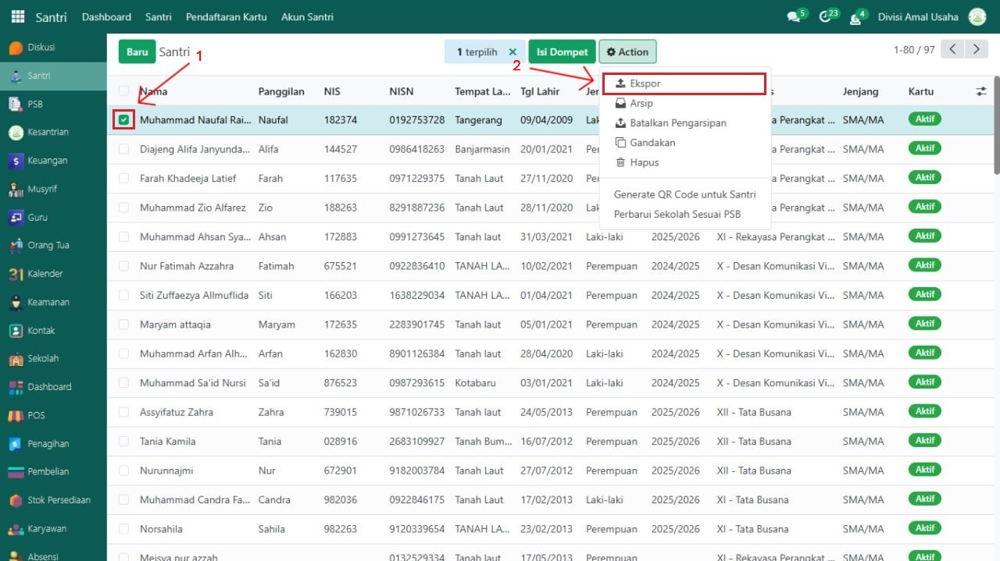
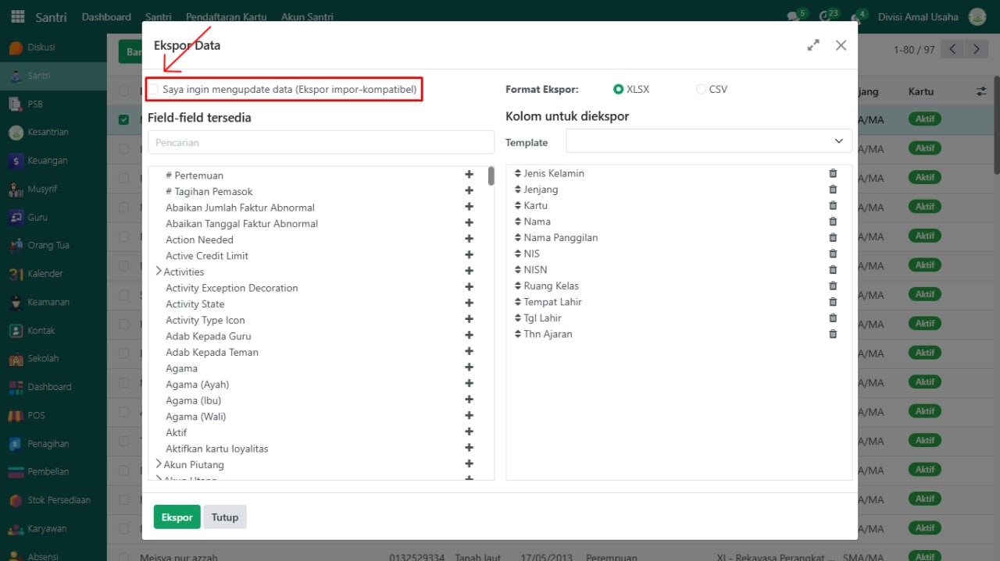
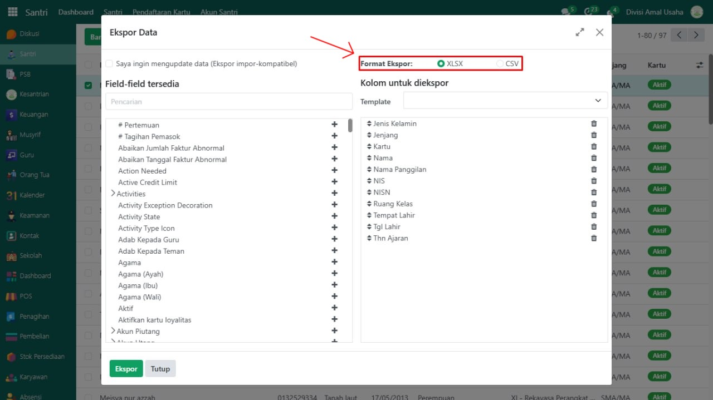
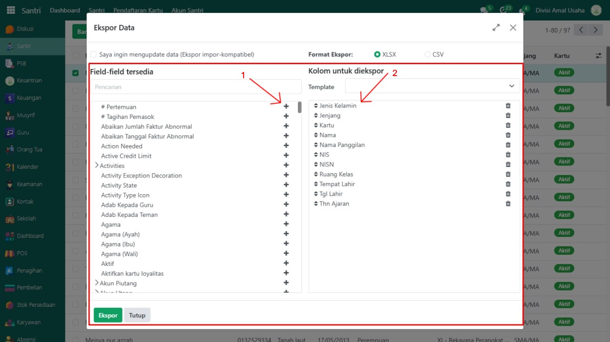
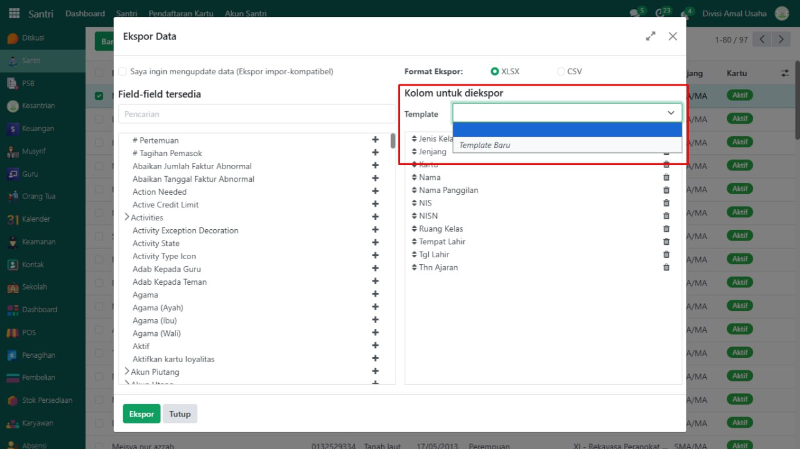
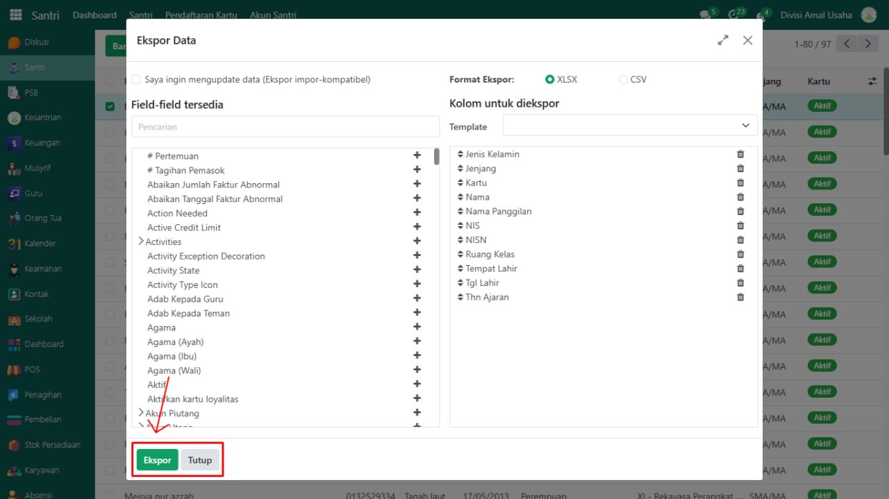
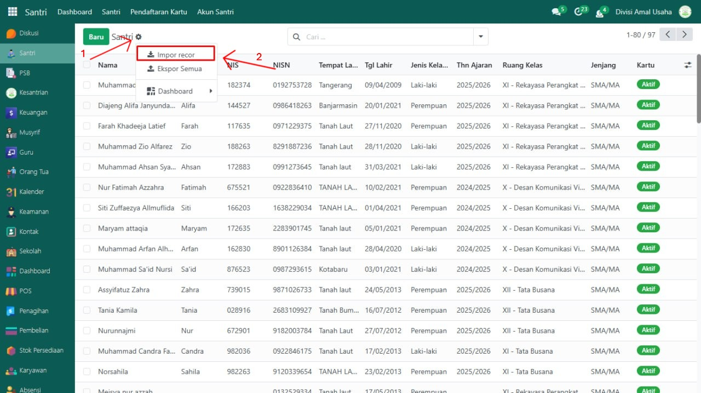
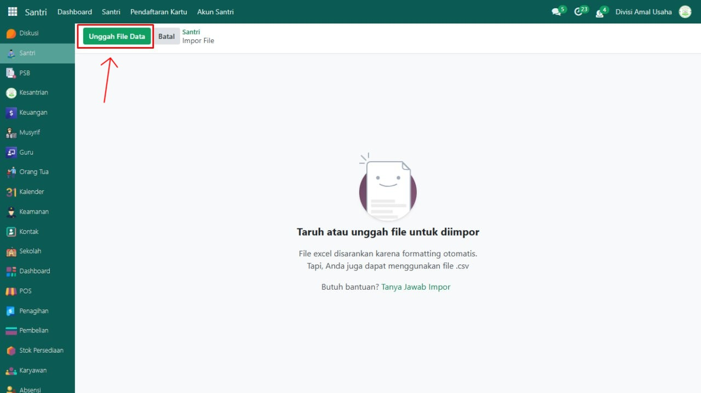
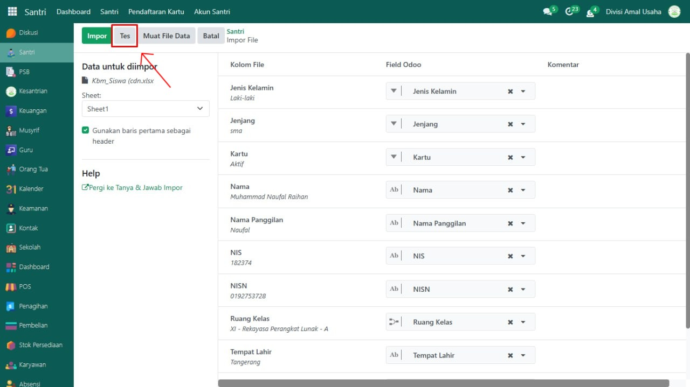
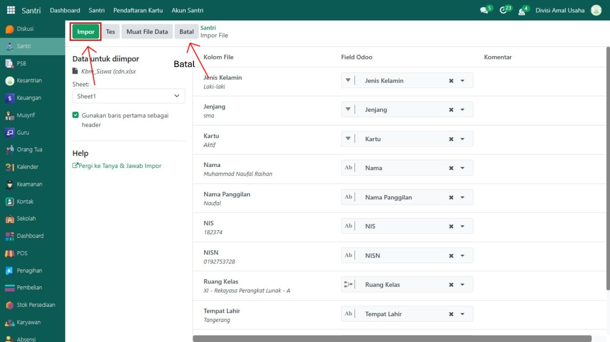

# Export & Import Data



## Export & Import Data

Odoo menyediakan fitur **Export dan Import Data** yang sangat berguna untuk memindahkan, memperbarui, atau mengisi data dalam jumlah besar antar lingkungan Odoo atau dari/ke sistem eksternal. Fitur ini umumnya digunakan untuk migrasi data dari sistem lain ke Odoo, serta pengisian, backup, dan update data dalam jumlah yang besar. Fitur ini tersedia di semua modul yang ada pada Odoo.

## Export Data

**Export Data** digunakan untuk mengambil data dari Odoo dan menyimpannya dalam format file .csv atau .xlsx, sehingga bisa digunakan untuk backup, analisis, atau template impor.&#x20;

Berikut adalah langkah-langkah melakukan ekspor data pada Odoo Pesantren.

1.  Buka modul yang datanya akan di ekspor, misalnya pada data **Santri**.

    <figure><figcaption></figcaption></figure>

2. Pilih beberapa record yang akan di ekspor. Jika tidak dicentang, maka semua data akan diekspor.
3.  Klik icon **"Gear"** atau tombol **"Action"**, lalu pilih opsi **"Ekspor"**.

    <figure><figcaption></figcaption></figure>

4.  Centang **"Saya ingin mengupdate data (Ekspor impor-kompatibel)"** jika kamu ingin mengekspor data untuk diedit dan diimpor kembali guna memperbarui data di Odoo.

    <figure><figcaption></figcaption></figure>

5.  Pilih Format Ekspor .XLSX atau .CSV

    <figure><figcaption></figcaption></figure>

6.  Pilih field dari kolom kiri (Field-field tersedia), klik + untuk menambah. Pastikan field yang dipilih muncul di kolom kanan (Kolom untuk diekspor).

    <figure><figcaption></figcaption></figure>

7.  Simpan atau pilih Template jika sering digunakan.

    <figure><figcaption></figcaption></figure>

8.  Klik tombol **"Ekspor"** untuk mengunduh file, Tutup untuk membatalkan.

    <figure><figcaption></figcaption></figure>

## Import Data

**Import Data** digunakan untuk memasukkan data baru atau memperbarui data yang sudah ada ke dalam sistem Odoo, menggunakan file berformat .csv atau .xlsx.&#x20;

Berikut adalah langkah-langkah melakukan impor data pada Odoo Pesantren.

1.  Buka modul yang akan di beri/impor data, misalnya pada data **Santri**.

    <figure><figcaption></figcaption></figure>

2.  Klik icon **"Gear"** atau **"Action"**, lalu pilih opsi **"Impor Rekor"**.

    <figure><figcaption></figcaption></figure>

3.  Klik tombol **"Unggah File Data"** dan pilih file yang telah disiapkan.

    <figure><figcaption></figcaption></figure>

4.  Sistem odoo akan mencoba mencocokkan nama kolom dari file ke field model Odoo. Jika tidak cocok, kamu bisa memilih mapping secara manual dengan field yang ada.

    <figure><figcaption></figcaption></figure>

5.  Klik tombol **"Tes"** terlebih dahulu untuk memastikan tidak ada error.

    <figure><figcaption></figcaption></figure>

6.  Jika tidak ada error, klik tombol **"Impor"** untuk melanjutkan. Klik tombol **"Batal"** Untuk membatalkan.

    <figure><figcaption></figcaption></figure>

***


**Tips & Catatan:**

1. Gunakan ekspor terlebih dahulu untuk mendapatkan template file .csv yang sesuai dengan struktur field.
2. Saat mengimpor, pastikan format tanggal, boolean, dan ID relasi sudah sesuai dengan standar Odoo.
3. Untuk relasi (misal: customer di invoice), pastikan nama partner harus sudah ada di database.
4. Gunakan kolom External ID untuk menghindari duplikasi saat mengimpor ulang data yang sudah ada.
5. Jangan ubah kolom id kecuali kamu benar-benar paham dampaknya.

