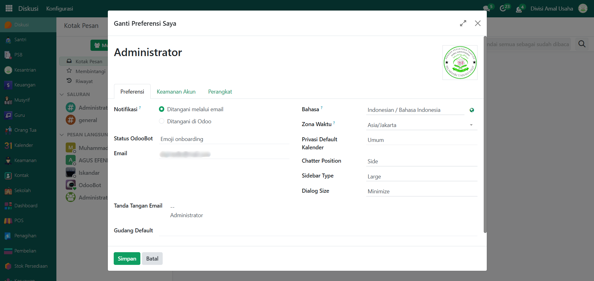

# Kirim Email Reset Password

Video \[]

## Reset Password via Kirim Email

Fitur ini memungkinkan administrator untuk mengirimkan tautan reset password langsung ke email pengguna. Dengan metode ini, pengguna dapat mengatur ulang kata sandi mereka secara mandiri melalui tautan yang diberikan, tanpa perlu intervensi manual pada sistem.

### Melakukan Reset Password via Kirim Email

Berikut adalah langkah-langkah cara melakukan reset password via kirim email dari **administrator** pada Odoo Pesantren.

1.  Pastikan kamu login dengan akun yang memiliki hak akses sebagai **administrator**.

    <figure><figcaption></figcaption></figure>

2.  Buka menu **Pengaturan** → **User & Perusahaan** → **Pengguna**.

    <figure><figcaption></figcaption></figure>

3.  Pilih pengguna yang ingin direset kata sandinya.

    <figure><figcaption></figcaption></figure>

4.  Pada halaman formulir pengguna, klik tombol **"Kirim Instruksi Reset Kata Sandi"**.

    <figure><figcaption></figcaption></figure>

5.  Tunggu hingga muncul notifikasi yaitu **"Link reset password telah dikirim melalui email"**.

    <figure><figcaption></figcaption></figure>

6.  Masuk ke akun email Anda, lalu cek email instruksi reset password dari Odoo Pesantren, setelah itu klik tombol **"Ubah Password"** pada email tersebut.

    <figure><figcaption></figcaption></figure>

7.  Anda akan terarahkan ke halaman reset password Odoo Pesantren lalu masukkan password baru Anda dan konfirmasi password baru.

    <figure><figcaption></figcaption></figure>

8.  Anda berhasil masuk ke akun yang telah direset passwordnya.

    <figure><figcaption></figcaption></figure>

***


**Catatan:**
&#x20;

Email tidak akan terkirim jika server email belum dikonfigurasi ([SMTP Gmail](../smtp-gmail.md)).
&#x20;Pastikan field Email pada user sudah terisi dengan benar.

