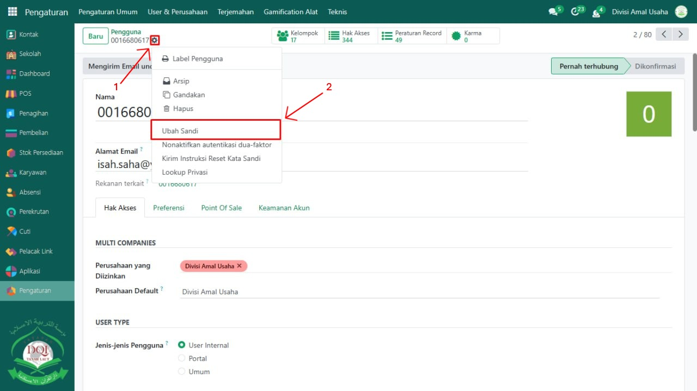
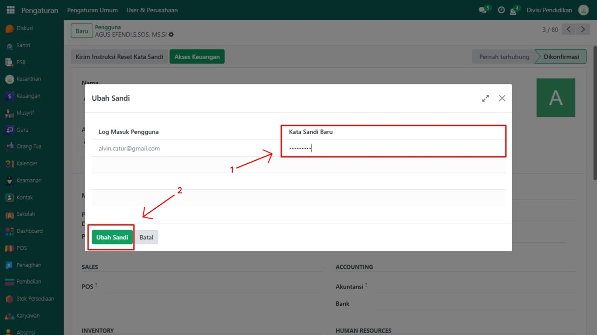

# Reset Password Manual

## Reset Password Manual oleh Administrator

Video \[]

Berikut adalah langkah-langkah cara melakukan reset password oleh administrator:

1.  Masuk ke menu: Pengaturen > User dan Perusahaan > Pengguna.

    <figure><figcaption></figcaption></figure>
2.  Pilih user yang ingin diubah password-nya.

    <figure><figcaption></figcaption></figure>
3.  Klik tombol berbentuk gir, lalu pilih opsi "Ubah Sandi".

    <figure><figcaption></figcaption></figure>
4.  Ketikkan password baru pada kolom yang tersedia, lalu klik "Ubah Sandi" untuk menyimpan perubahan.

    <figure><figcaption></figcaption></figure>

***

> Tips Tambahan:
> \
> Aktifkan Developer Mode jika field password tidak terlihat (Pergi ke Settings > Activate Developer Mode).
> \
> Untuk keamanan, pastikan password baru tidak mudah ditebak dan pengguna segera menggantinya setelah login.
