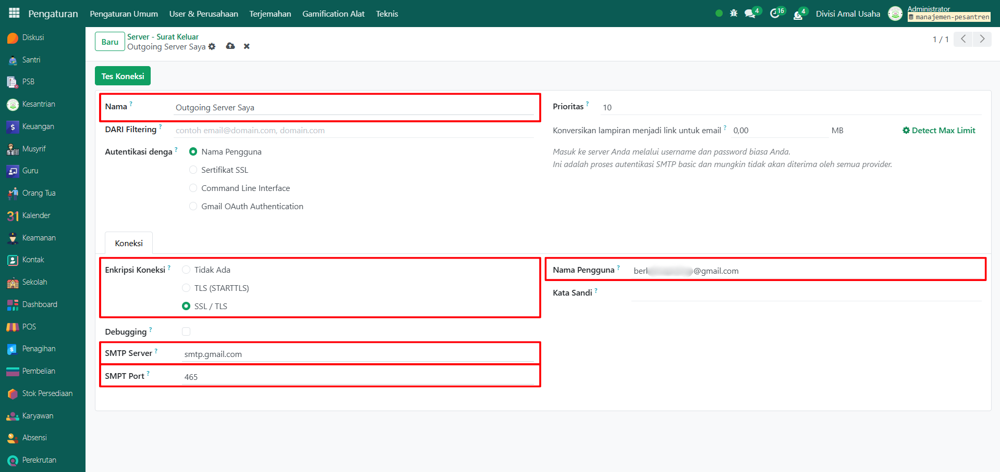

# SMTP Gmail



## SMTP Gmail

**SMTP Gmail** digunakan untuk menghubungkan sistem Odoo dengan server Gmail, sehingga Odoo dapat mengirimkan email keluar secara otomatis, misalnya untuk notifikasi, verifikasi, atau laporan.

### Mengkonfigurasi SMTP Gmail

Berikut adalah langkah-langkah untuk mengkonfigurasi SMTP Gmail pada Odoo Pesantren.

1.  Buka **Pengaturan**, scroll ke bawah lalu aktifkan **Mode Pengembang**.

    <figure><figcaption></figcaption></figure>

2.  Setelah mode pengembang aktif, pastikan menu **Teknis** muncul di **Pengaturan**, kemudian klik menu **Teknis** lalu pilih submenu **Server - Surat Keluar**.

    <figure><figcaption></figcaption></figure>

3.  Klik tombol **"Baru"** untuk membuat server SMTP Gmail baru.

    <figure><figcaption></figcaption></figure>

4.  Isi form yang tersedia dengan data berikut:

    * **Nama Server** (misalnya: Outgoing Server Saya)
    * **Enkripsi Koneksi**: pilih _SSL/TLS_
    * **SMTP Server**: `smtp.gmail.com`
    * **SMTP Port**: `465`
    * **Nama Pengguna**: alamat Gmail Anda
    * **Kata Sandi**: gunakan sandi aplikasi Gmail (bukan password utama).

    <figure><figcaption></figcaption></figure>

5.  Untuk mendapatkan **Sandi Aplikasi**, buka [Google Account](https://accounts.google.com/), cari di kolom pencarian **Sandi Aplikasi.**

    <figure><figcaption></figcaption></figure>

6.  Lalu buat sandi aplikasi baru (misalnya: _Odoo Pesantren – Outgoing Gmail_), setelah isian terisi klik tombol **"Buat"** untuk membuat **Sandi Aplikasi**.

    <figure><figcaption></figcaption></figure>

7.  Copy sandi aplikasi yang muncul di pop-up.

    <figure><figcaption></figcaption></figure>

8.  Lalu paste ke kolom **Kata Sandi** pada form server SMTP Gmail di Odoo.

    <figure><figcaption></figcaption></figure>

9.  Klik icon **Simpan** di sebelah kanan icon **Gear** agar server SMTP Gmail tersimpan di sistem.

    <figure><figcaption></figcaption></figure>

10. Terakhir, klik tombol **"Tes Koneksi"** untuk memastikan koneksi berhasil dan server SMTP Gmail dapat digunakan untuk mengirim email.

    <figure><figcaption></figcaption></figure>

11. Jika tes berhasil, maka server email siap dipakai Odoo untuk semua notifikasi keluar.
